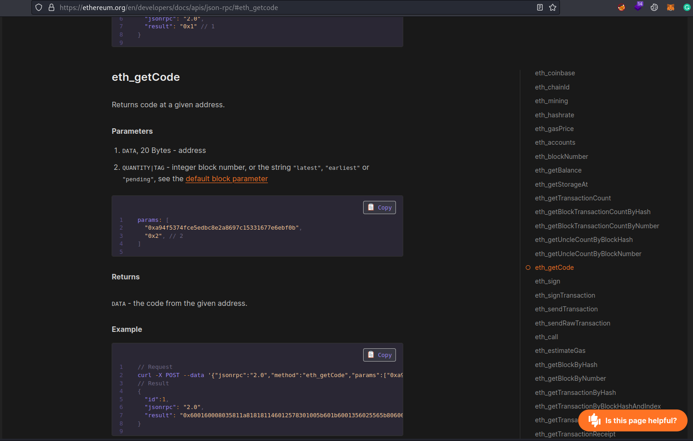
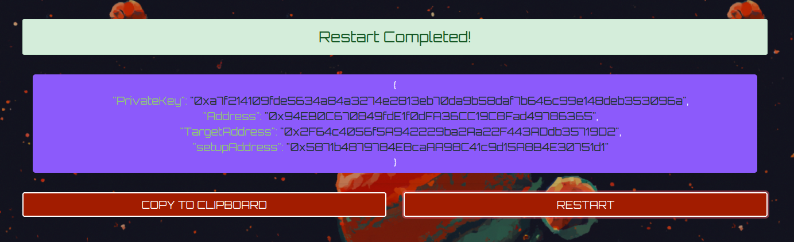
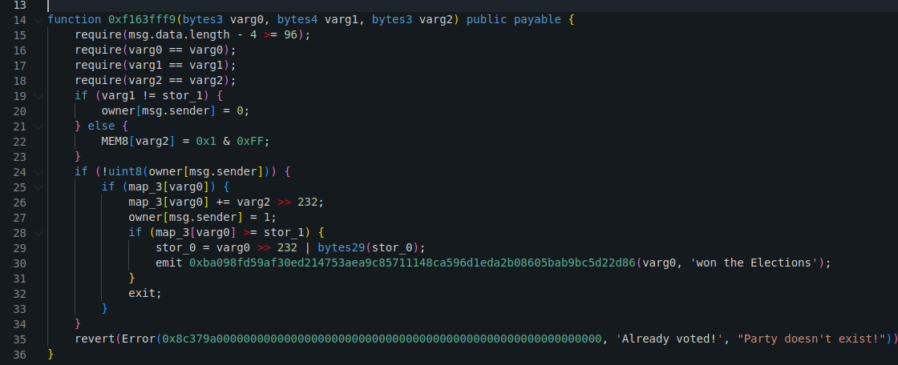
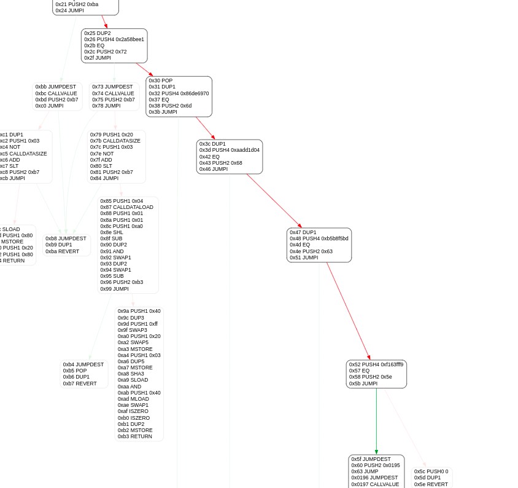
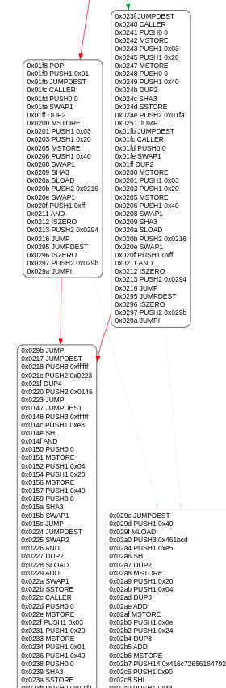
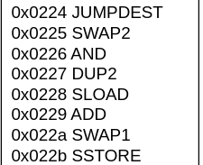

<font size='10'>2244 ELECTIONS</font>

> Date: 10<sup>th</sup> July 2023 \
Challenge Author: <font color=#1E9F9A>perrythepwner</font> \
Difficulty: <font color=yellow>Medium</font> \
Category: <font color=orange>Blockchain</font>

# TL;DR

- The challenge consists of a smart contract e-voting system which turns out to have a backdoor as a private function. The source code is not provided, through the JSON-RPC the players must take the bytecode deployed on the blockchain and reverse it to discover and exploit the backdoor.

## Description

> It's the year 2244 and it's Elections time between United Nations of Zenium (UNZ) and Board of Arodor (BoA) to establish the new world order.
You, a skilled hacker aligned with the United Nations of Zenium, suspected the presence of a well-concealed backdoor in the e-voting system that could manipulate the outcome of the elections.  
> The source code is not public, but nothing is secret on the block...


## Skills Required

- EVM basics.
- Basic Solidity bytecode reversing: decompiling, EVM opcodes.
- Smart Contract interaction without ABI: function signatures, constructing raw TXs.

## Skills Learned

- Reverse engineering smart contracts from the compiled bytecode.
- JSON-RPC interaction and calling methods.
- Reading smart contracts private variables via storage.
- Identify backdoors on unverified smart contracts.
- Reading CFG of smart contracts.

# Enumeration

## EVM background

In the EVM, nothing is secret. \
This is the reason why usually hiding passwords, keys, scams, in a deployed smart contract is not a great idea.
However, those who have to hide something in the blockchain, try to obfuscate it as much as possible, to be less accessible as possible to the majority of people. \
The most commonly used techniques are: 
- private functions and private variables (can be called only by the contract itself).
- non-verified smart contract (contract code is not public).

## Challenge scenario

With this challenge we'll learn to extract the bytecode (necessarily deployed in the blockchain) via the JSON-RPC endpoint and reverse the "hidden" code to understand how it works. \
The simulated real-world scenario is presented as an e-voting system. 
The challenge walkthrough will be done without looking at the source code at the beginning to put us in the player's point of view, which is more realistic. 

This is what it's presented on the voting platform:


There is `/home` and `/connection` endpoints. \
On the page it's displayed the current elections status: the Board of Arodor dictatorship has already a clear advantage over the United Nations of Zenium democracy: 99% vs 8% ... a bit suspicious. 

## Interacting with the platform

Clicking on the "vote" buttons a popup appears that allows us to cast our vote in favor of one party or another:


Let's try to vote for UNZ.


We want UNZ to win, so let's try to vote again and open Network Monitor to see which requests are being sent to the backend.


Clearly the platform doesn't allow this. Only one vote per account is given. \
Looking at the requests made, we see a call to `/connection_info` which connects our web3 account to the platform (simulated metamask behavior) and gives us respectively the addresses for the e-voting contract and Setup contract. \
Then we made RPC calls to `/rpc` methods with the following methods:
1) `eth_sendTransaction`: constructing and sending the raw TX with our encoded input on `data`


2) `eth_getTransactionReceipt` : the previous call returned the TX hash, used then to retrieve the TX receipt.  


3) In the TX receipt it's given `status: "0x0"` because it failed. with `eth_call` it retrieves the revert reason and displays the message on the page.


That's exactly what the client is doing and we confirm that visualizing the Page Source:


Additional information we can extract here is that:
1) The contract function call is made with the function signature of `publicVote(bytes3,bytes4,bytes3)` which is a bit weird because we were made to choose only one parameter (bytes3 string of the selected party) and then padded to 200 bytes (8 bytes function signature + 64 bytes first param + 64 bytes second param + 64 bytes third param).    

2) Contract calls are made via the RPC, fetching the `/rpc` endpoint with raw requests, despite having the web3.js library available, with which contracts calls are usually made. \
This unusual behavior, along with the comment linking the official ethereum guide for interacting with JSON-RPC endpoints, it's a hint to explore JSON-RPC methods available for players facing this new scenario. Finding then that it's possible to dump the bytecode compiled via the `eth_getCode()` method. 
Which clearly sounds useful, given that the smart contract code is not provided by the challenge. 



# Analysis

## Dumping the bytecode

Understood that, let's navigate to `/connection` endpoint and reset the challenge to have again the possibility to vote.
   


 Copy the new connection info and save them as bash variables. Take the Ethereum documentation example to call `eth_getCode` method and dump the compiled Solidity code in the blockchain.

```bash
$ curl -X POST -H "Content-Type: application/json" --data '{"jsonrpc":"2.0","method":"eth_getCode","params":["'$TARGET_ADDRESS'", "latest"],"id":"1"}' $RPC_URL

{"jsonrpc":"2.0","id":"1","result":"0x608060405234801561000f575f80fd5b5060043610610060575f3560e01c80631ee7b2d7146100645780632a58bee11461008e57806386de6970146100c0578063aadd1d04146100d7578063b5b8f5bd146100ec578063f163fff91461010b575b5f80fd5b5f546100709060e81b81565b6040516001600160e81b031990911681526020015b60405180910390f35b6100b061009c3660046102d2565b60026020525f908152604090205460ff1681565b6040519015158152602001610085565b6100c960015481565b604051908152602001610085565b6100ea6100e536600461031b565b61011e565b005b6100c96100fa36600461031b565b60036020525f908152604090205481565b6100ea610119366004610334565b6101b9565b6001546001600160e81b031982165f90815260036020526040902054106101b6575f805462ffffff191660e883901c179055604080516001600160e81b0319831681526020810182905260118183015270776f6e2074686520456c656374696f6e7360781b606082015290517fba098fd59af30ed214753aea9c85711148ca596d1eda2b08605bab9bc5d22d86916080908290030190a15b50565b60015482148080156101ce57600183536101de565b335f908152600260205260408120555b5050335f9081526002602052604090205460ff16156102355760405162461bcd60e51b815260206004820152600e60248201526d416c726561647920766f7465642160901b60448201526064015b60405180910390fd5b6001600160e81b031983165f908152600360205260409020546102915760405162461bcd60e51b8152602060048201526014602482015273506172747920646f65736e27742065786973742160601b604482015260640161022c565b6001600160e81b031983165f908152600360209081526040808320805460e886901c01905533835260029091529020600190556102cd8361011e565b505050565b5f602082840312156102e2575f80fd5b81356001600160a01b03811681146102f8575f80fd5b9392505050565b80356001600160e81b031981168114610316575f80fd5b919050565b5f6020828403121561032b575f80fd5b6102f8826102ff565b5f805f60608486031215610346575f80fd5b61034f846102ff565b925060208401356001600160e01b03198116811461036b575f80fd5b9150610379604085016102ff565b9050925092509256fea264697066735822122027f852d100827d1fafc9891985e19bed9d0fc67a9d14ca60307b5392bab3d56564736f6c63430008140033"} 
```

Save it in env var.
```bash
└─$ BYTECODE=$(curl -s -X POST -H "Content-Type: application/json" --data '{"jsonrpc":"2.0","method":"eth_getCode","params":["'$TARGET_ADDRESS'", "latest"],"id":"1"}' $RPC_URL | jq -r '.result')     

└─$ echo $BYTECODE                                           
0x60806040...

```

## Reversing EVM bytecode

Now we have the compiled bytecode.
1) We can try to use a decompiler, which could give us inaccurate results but a good overview.
2) Alternatively we can plot the Control Flow Graph (CFG) of the opcodes and analyze it to have a total and certain understanding of the smart contract flow, with the help of https://www.evm.codes if needed. (who needs contract code when we have bytecode? :))

Players will tend to go towards the first option, as it is more immediate and simple.
So let's look for the decompiler option first.

1.1) Searching "solidity bytecode decompiler" or similar in google, mainly 2 decompilers will appear: [ethervm Decompiler](https://ethervm.io/decompile) and [Dedaub Decompiler](https://library.dedaub.com/decompile).
   The second one is newer and actively maintained, will prompt more accurate results.
   
```solidity
// Compiled using the solidity compiler version 0.8.20

// Data structures and variables inferred from the use of storage instructions
uint256 stor_0; // STORAGE[0x0]
uint256 stor_1; // STORAGE[0x1]
mapping (uint256 => uint256) owner; // STORAGE[0x2]
mapping (uint256 => uint256) map_3; // STORAGE[0x3]

function 0xf163fff9(bytes3 varg0, bytes4 varg1, bytes3 varg2) public payable { 
    require(msg.data.length - 4 >= 96);
    require(varg0 == varg0);
    require(varg1 == varg1);
    require(varg2 == varg2);
    if (map_3[varg0]) {
        if (varg1 == stor_1) {
            owner[msg.sender] = 0;
        } else {
            MEM8[varg2] = 0x1 & 0xFF;
        }
        if (!uint8(owner[msg.sender])) {
            map_3[varg0] += varg2 >> 232;
            owner[msg.sender] = 1;
            if (map_3[varg0] >= stor_1) {
                stor_0 = varg0 >> 232 | bytes29(stor_0);
                emit 0xba098fd59af30ed214753aea9c85711148ca596d1eda2b08605bab9bc5d22d86(varg0, 'won the Elections');
            }
            exit;
        }
    }
    revert(Error(0x8c379a000000000000000000000000000000000000000000000000000000000, "Party doesn't exist!", 'Already voted!'));
}

function () public payable { 
    revert();
}

function 0x1ee7b2d7() public payable { 
    return bytes3(stor_0 << 232);
}

function 0x2a58bee1(address varg0) public payable { 
    require(msg.data.length - 4 >= 32);
    require(varg0 == varg0);
    return bool(uint8(owner[varg0]));
}

function 0x86de6970() public payable { 
    return stor_1;
}

function 0xaadd1d04(bytes3 varg0) public payable { 
    require(msg.data.length - 4 >= 32);
    require(varg0 == varg0);
    if (map_3[varg0] >= stor_1) {
        stor_0 = varg0 >> 232 | bytes29(stor_0);
        emit 0xba098fd59af30ed214753aea9c85711148ca596d1eda2b08605bab9bc5d22d86(varg0, 'won the Elections');
    }
}

function 0xb5b8f5bd(bytes3 varg0) public payable { 
    require(msg.data.length - 4 >= 32);
    require(varg0 == varg0);
    return map_3[varg0];
}

// Note: The function selector is not present in the original solidity code.
// However, we display it for the sake of completeness.

function __function_selector__(bytes4 function_selector) public payable { 
    MEM[64] = 128;
    require(!msg.value);
    if (msg.data.length >= 4) {
        if (0x1ee7b2d7 == function_selector >> 224) {
            0x1ee7b2d7();
        } else if (0x2a58bee1 == function_selector >> 224) {
            0x2a58bee1();
        } else if (0x86de6970 == function_selector >> 224) {
            0x86de6970();
        } else if (0xaadd1d04 == function_selector >> 224) {
            0xaadd1d04();
        } else if (0xb5b8f5bd == function_selector >> 224) {
            0xb5b8f5bd();
        } else if (0xf163fff9 == function_selector >> 224) {
            0xf163fff9();
        }
    }
    ();
}


```

This is the decompilation result. As expected, not very accurate but gives a good overview.
- `0xf163fff9` function is `publicVote(bytes3,bytes4,bytes3)`, let's look closely:
  


The first require statements are redundant. \
1.2) Firstly checks that `(map_3[varg0])` exits in the `map3` mapping. If that doesn't exists, it revert with error `"Party doesn't exist!"`.  `varg0` is `_party` choice, meaning that here it's checking if we are voting a valid party. \
1.3) Then, if party exists, it compares `varg1` and `stor_1`. If they ARE NOT equal it take `varg2` from memory and set to 1 (and mask it with 0xff).  If they ARE equal, take msg.sender in the `owner` mapping (wrong naming) and set it to 0. \
1.4) Just after that if `owner[msg.sender]` is set to `true`, it reverts with `'Already voted!'`. \
1.5) Otherwise continue the execution, update `map_3[varg0]` mapping adding `varg2` and compare the result with `stor_1` variable. If the result is greater than, it emits an event telling which party won the Elections.

### What does that mean?
Starting from the bottom, we need to reach the count of votes that is >= to `stor_1` variable, in order to win the elections. To do that, we can update the mapping responsible to keep the count with a value we can control, which is `varg2`... but only if  `varg1` and `stor_1` values are equal, to avoid `varg2` being set to 1 (otherwise we'll need millions of votes) and to be able to vote multiple times bypassing the  `'Already voted!'` check.

In other words, we're impliciting saying that the `stor_1` is the magic value to trigger the backdoor and cast lots of votes in our favor!

2.1) The same can be done analyzing the CFG (Control Flow Graph) of the contract if we get inaccurate results from the decompilation. \
That can be done using [heimdall](https://github.com/Jon-Becker/heimdall-rs) tool or many others, i.e:

```bash
└─$ ./heimdall cfg -v -c bytecode.evm  
info: disassembled 899 bytes successfully.
```
Looking at the top of the CFG we can see a classic function dispatcher/selector structure:



2.2) The `0xf163fff9` function is the one we're interested in because kekkak256 of `publicVote(bytes3,bytes4,bytes3)` is `0xf163fff96651...`. \
Let's look closely to search for SSTORE opcodes because we know that our vote is stored in a mapping:

 

Here's two. That's what we're looking for. These are the instructions that update the mapping that tracks whether an address has already voted or not. We're sure on that because we can see `CALLER` and `SHA3` opcodes. \

2.3) That's the instructions that lets us vote multiple times:


Because it pushes `0x0` and store it in `owner[msg.sender]` mapping.

2.4) And here's the instructions that update the mapping that tracks the votes count with `ADD`:



### How to reach that block?

2.5) Going back a little bit it's easy to see what's the condition to trigger this blocks of instructions:


Here the backdoor PUSH `0x1` and then do `SLOAD`, meaning that it's loading the storage variable at index 1 (which is, the secret, `0xf00dbabe`). \
Then it compares our input with that secret with `EQ` opcode which will return `0x1` if are equal (https://www.evm.codes/#14?fork=shanghai), and subsequently jumping in the code of interest (green arrow).


# Solution

## Exploitation

First of all, we need to retrieve `stor_1` value. That can be easily done with `eth_getStorageAt` JSON-RPC method:

```bash
└─$ curl -X POST -H "Content-Type: application/json" --data '{"jsonrpc":"2.0","method":"eth_getStorageAt","params":["'$TARGET_ADDRESS'", "0x0", "latest"],"id":1}' $RPC_URL
{"jsonrpc":"2.0","id":1,"result":"0x00000000000000000000000000000000000000000000000000f00dbabe000000"} 
```
> [reference to f00dbabe Hardware Wallet Hack](https://www.youtube.com/watch?v=nNBktKw9Is4)

then, the vote count target:

```bash
└─$ curl -X POST -H "Content-Type: application/json" --data '{"jsonrpc":"2.0","method":"eth_getStorageAt","params":["'$TARGET_ADDRESS'", "0x1", "latest"],"id":1}' $RPC_URL
{"jsonrpc":"2.0","id":1,"result":"0x0000000000000000000000000000000000000000000000000000000008f0d180"} 
```

which is, `150000000`. We can now add arbitrary votes with the only limit of being a bytes3. The maximum integer value representable by bytes3 is `0xffffff`. Let's calculate how many times we need to trigger the backdoor, knowing that UNZ party has already 8% votes:

```python
>>> ( 150_000_000 - (150_000_000 * 0.08) ) / 0xffffff
8.225441469278422
```

We need to trigger backdoor at least 9 times. \
We can do that, again, with the JSON-RPC (even intercepting and modifying requests with BurpSuite), or with `cast send` (the easier one).

```sh
$ cast send $TARGET_ADDRESS "publicVote(bytes3,bytes4,bytes3)" "0x554e5a" "0xf00dbabe" "0xffffff" --rpc-url $RPC_URL --private-key $PRIVATE_KEY                   
```

After 9 calls we can get the flag either by performing a request to the `/flag` API endpoint or by refreshing the page:

