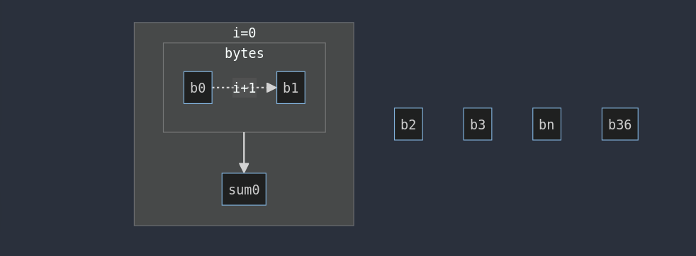
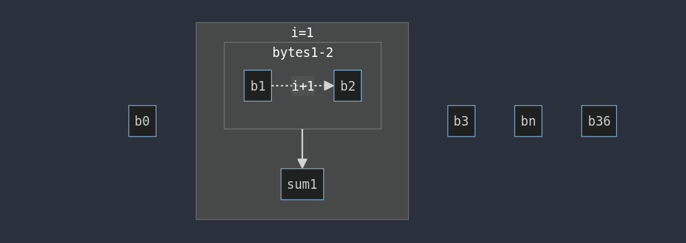

# HTB University CTF 2023 - WindowsOfOpportunity


## TL;DR

* The challenge consisted of reversing a window-sliding algorithm knowing a known byte and/or bruteforcing it.

## Challenge description

> You've located a zombie hideout and are trying to peek inside. Suddenly, a window opens a crack and a zombie peers out - they want a password...

## Challenge scenario

We're given an executable, decompiling it with Ghidra will result in the following:

```c
int main(void)

{
  char local_38 [43];
  char local_d;
  uint local_c;
  
  puts("A voice comes from the window... \'Password?\'");
  fgets(local_38,0x2a,stdin);
  local_c = 0;
  
  while( true ) {
    if (0x24 < local_c) {
      puts("The window opens to allow you passage...");
      return 0;
    }
    local_d = local_38[(int)(local_c + 1)] + local_38[(int)local_c];
    if (local_d != arr[(int)local_c]) break;
    local_c = local_c + 1;
  }

  puts("The window slams shut...");
  return -1;
}
```

The code is quite simple and short, it appears to be a simple window-sliding algorithm to check the password (i.e. the flag).  
Meaning that, for each index of our input, it'll take the corresponding byte and the following one, sum them, and if their sum corresponds to the corresponding index value saved in the global variable `arr` the execution continues. Until eventually "The window opens to allow you passage..." (i.e we've discovered the flag).\
The code it's already clear enough to be able to reproduce a reversing algorithm, but for readability sake here's a refactored version:

```c
int main(void)

{
  char input [43];
  char sum;
  int n;
  
  puts("A voice comes from the window... \'Password?\'");
  fgets(input,42,stdin);
  n = 0;
  while( true ) {
    if (36 < n) {
      puts("The window opens to allow you passage...");
      return 0;
    }
    sum = input[n + 1] + input[n];
    if (sum != arr[n]) break;
    n = n + 1;
  }
  puts("The window slams shut...");
  return -1;
}
```

This is instead the global variable `arr`:

```
00104060 9c   [0]
00104061 96   [1]
00104062 bd   [2]
00104063 af   [3]
00104064 93   [4]
00104065 c3   [5]
00104066 94   [6]
00104067 60   [7]
00104068 a2   [8]
00104069 d1   [9]
0010406a c2   [10]
0010406b cf   [11]
0010406c 9c   [12]
0010406d a3   [13]
0010406e a6   [14]
0010406f 68   [15]
00104070 94   [16]
00104071 c1   [17]
00104072 d7   [18]
00104073 ac   [19]
00104074 96   [20]
00104075 93   [21]
00104076 93   [22]
00104077 d6   [23]
00104078 a8   [24]
00104079 9f   [25]
0010407a d2   [26]
0010407b 94   [27]
0010407c a7   [28]
0010407d d6   [29]
0010407e 8f   [30]
0010407f a0   [31]
00104080 a3   [32]
00104081 a1   [33]
00104082 a3   [34]
00104083 56   [35]
00104084 9e   [36]
```

## Solution

We have therefore understood that to solve the challenge we must find the correct bytes which, added together, will give a certain value.\
But how do we know which is the exact pair of bytes that will give us the flag piece by piece?\
Thinking about it, the combination of interest is very easy to bruteforce, but it is even easier if we knew even just one byte of the "secret" to discover, given that to obtain the subsequent ones it will be enough to do a simple subtraction!\
Why?\
Let's visualize the algorithm:



At the first iteration, the first two bytes (`b1` and `b2`) are taken into consideration, their sum (`sum0`) should be equal to `arr[0]` which is `0x9c` (156).



At the second iteration, the second byte (again) and the third byte (`b1` and `b2`) are taken in consideration, their sum (`sum1`) should be equal to `arr[1]` which is `0x96` (150).

Therefore, knowing `sum0` from `arr[0]`, and assuming that we also know `b0` then `b1` is simply the value of `sum0-b0`. Thus obtaining `b1`, the value of `b2` is simply `sum1-b1` and so on.\
Aaand, we know `b0`! Since the flag starts with `HTB{`, therefore `b0 == H == 0x48 == 72`. Let's write a simple reversing script in python:

```python
#!/usr/bin/env python

arr = [0x9c, 0x96, 0xbd, 0xaf, 0x93, 0xc3, 0x94, 0x60, 0xa2, 0xd1, 0xc2, 0xcf, 0x9c, 0xa3, 0xa6, 0x68, 0x94, 0xc1, 0xd7, 0xac, 0x96, 0x93, 0x93, 0xd6, 0xa8, 0x9f, 0xd2, 0x94, 0xa7, 0xd6, 0x8f, 0xa0, 0xa3, 0xa1, 0xa3, 0x56, 0x9e]
flag = [ord('H')]

for i, sum in enumerate(arr):
    flag.append(sum-flag[i])

for c in flag:
	print(chr(c),end='')
```

```sh
└─$ python exploit.py
HTB{4_d00r_cl0s35_bu7_4_w1nd0w_0p3n5!} 
```

Flag: `HTB{4_d00r_cl0s35_bu7_4_w1nd0w_0p3n5!}`
