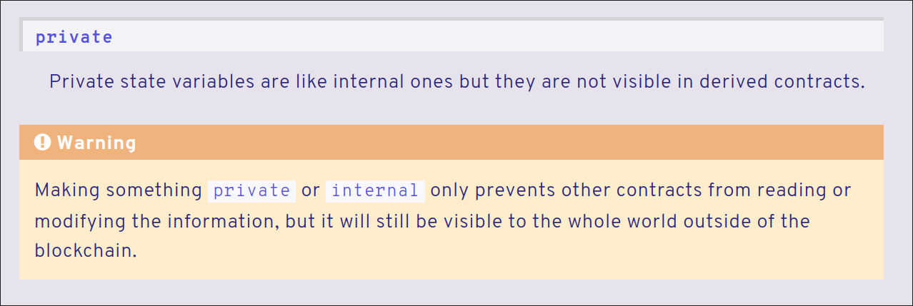

# CryoPod

> 4<sup>th</sup> Dec 2024 \
Prepared By: perrythepwner \
Challenge Author(s): perrythepwner \
Difficulty: <font color=lightgreen>Very-Easy</font>

---

## TLDR
This challenge consists of reading the cryogenically stored secrets of simulated users in the smart contract by analyzing emitted events, examining contract storage, or decoding transactions.

## Description
> In the shadowed reaches of the Frontier Cluster, where lawlessness reigns and the oppressive Frontier Board tightens its grip, people lost hope for a prosperous future and decided to undergo cryogenic preservation, to be awakened in 50 years to a new world, or never to be awakened again.  
The CryoPod smart contract serves as a digital vault, housing the secrets of those who sought to preserve some of their most precious memories.

## Skills Required
- Basic understanding of Solidity and smart contracts
- Interaction with blockchain explorers (e.g., Etherscan, Blockscout, etc)
- Interaction with smart contracts

## Skills Learned
- Extracting informations from the Ethereum blockchain
- Interacting with blockchain explorers
- Interacting with smart contracts
- Analyzing blockchain data and transaction logs

## Challenge Scenario
Life on the Frontier Cluster was once peaceful, but the ruthless Frontier Board has transformed it into a desolate and lawless region. As a former inhabitant subjected to cryogenic imprisonment, you hold the key to overthrowing the Board. The CryoPod smart contract houses the secrets of those who have been cryogenically stored. To execute your plan, you must access and read these hidden secrets in the ledger.

## Analyzing the Source Code
The challenge provides the source code of the following contracts to players. To facilitate interaction with the blockchain, a [Blockscout](https://github.com/blockscout/blockscout) instance is also provided to the players.

### `Setup.sol`
As the name hints, it's a contract that's not directly the target to exploit but an instance used to deploy the actual challenge contracts and to verify solutions.

```solidity
pragma solidity ^0.8.0;

import { CryoPod } from "./CryoPod.sol";

contract Setup {
    CryoPod public immutable TARGET;
    bytes32 public flagHash = 0xfec0862a36a20acee57ee52f4503c7ea6bdfd96e351f7246c2c7794f1040c39e;

    event DeployedTarget(address at);

    constructor() payable {
        TARGET = new CryoPod();
        emit DeployedTarget(address(TARGET));
    }

    function isSolved(string calldata flag) public view returns (bool) {
        return keccak256(abi.encodePacked(flag)) == flagHash;
    }
}
```

From the initial analysis, to solve the challenge, a player must call the `isSolved()` function with a string argument that, when hashed, matches flagHash. Quantum hash cracking is not in scope for this challenge :p  
The final retrieved flag will be directly valid for submission on the platform, but this Setup + TCP challenge handler is provided anyway to players to familiarize themselves with the standard blockchain challenge infrastructure.

### `CryoPod.sol`
The CryoPod smart contract allows users to store and update personal pods containing sensitive information. Here's a look at the code:

```solidity
// SPDX-License-Identifier: MIT
pragma solidity ^0.8.0;

/**
 * @title CryoPod
 * @dev A smart contract that allows each user to create and store a personal pod with a piece of information.
 *      The information is stored permanently on the blockchain, and an event is emitted upon each storage action.
 */
contract CryoPod {
    mapping(address => string) private pods;

    event PodStored(address indexed user, string data);

    /**
     * @dev Stores or updates the caller's pod with the provided data.
     * @param _data The information to be stored in the user's pod.
     */
    function storePod(string memory _data) external {
        pods[msg.sender] = _data;
        emit PodStored(msg.sender, _data);
    }
}
```

In detail:
- **`pods` mapping**: A mapping in Solidity is a key-value store that associates one type of data with another. In particular, the `pods` mapping associates a transaction-sender's address with their stored secret.
- **`PodStored` event**: An event in Solidity is used to log specific actions that occur within the contract. The `PodStored` event is emitted every time a user stores or updates their pod, logging the user's address and the data.
- **`storePod` function**: Functions in solidity can modify and/or read the state of the contract and the blockchain. This function in particular allows users to store permanently some data on the contract, to be able to retrieve them in a distant future.


One of the pillar principles of the blockchain is that ***everything is public***, thanks to the decentralized systems concepts it leverages to offer an Immutable, Transparent, Decentralized ledger.  
Developers commonly have, and always had, limitations on writing per-users models on smart contracts, capable of defining and isolating the data that a user can access.  
While this might sounds a big limitation of developing on the blockchain, it's actually its inner nature and what distinguishes and makes this technology appreciable.  
That means, when reviewing a smart contract, you should always ask yourself "*Can other users read/write this?*", and the response is very likely yes.

In this contract, for example, we have the `pods` mapping that holds the user secrets, being declared as **private**. What does that means? In other programming languages, a construct that is labeled as `private` usually restricts the domain with which that data can be accessed. For example in Java, private members of class are not visible from outside the class itself.  
And this is what also happens in Solidity and smart contracts. Or rather... this is what happens at the implementation layer: see Solidity documentation [here](https://docs.soliditylang.org/en/latest/contracts.html#state-variable-visibility). However, the data from a smart contract is published and made available throughout the blockchain. This means that there are more "low level" methods that allow access to this data categorized as "private". For example, the storage layout of a contract is public and we can fetch the data contained in it by directly reading the memory of a smart contract using the RPC method `eth_getStorageAt`.  



In fact, a possible solution for this challenge could be to understand how Solidity mappings are arranged in memory, dump the contract storage memory, and extract all the secrets stored in the users pods.  
This can be a solution, but to make the challenge as accessible to all players as possible and to provide different facets of the concept of "*everything is public on the blockchain*", we can solve in different ways. Since all data on the blockchain remains publicly accessible, a player can:
- Extract all transactions in which `storePod` function calls were made to the target address (smart contract address), and decode the arguments passed to the function call to read the passed secrets. This can be done from the provided Blockscout explorer instance, or by using tools like [cast](https://book.getfoundry.sh/cast/), [web3py](https://web3py.readthedocs.io/en/stable/), or by using rpc methods directly. 
- Filter all `PodStored` events emitted by the contract, and read the `data` property

As PoC for the solver, the latter method is used.

## Exploitation

To solve this challenge, we can use web3py [`create_filter`](https://web3py.readthedocs.io/en/v5/filters.html#event-log-filters) method to fetch event logs on the blockhain.

```py
[...]
    CryoPod = w3.eth.contract(address=target_addr, abi=target_abi) # load contract instance
    event_filter = CryoPod.events.PodStored.create_filter(from_block=1) # subscribe to `PodStored` event
    events = event_filter.get_all_entries() # get all past emitted events
    [...] # poll for new emitted events
    while True:
        events = event_filter.get_new_entries()
        for event in events:
            print(f"    [>] User: {event.args.user}")
            print(f"    [>] Data: {event.args.data}") # access stored secret
            if "HTB{" in event.args.data:
                print(f"\n\n[!] Flag found: {event.args.data}")
                exit(0)
        time.sleep(5)
```

see the full exploitation script [here](./htb/solver.py).

---
> HTB{h3ll0_ch41n_sc0ut3r}