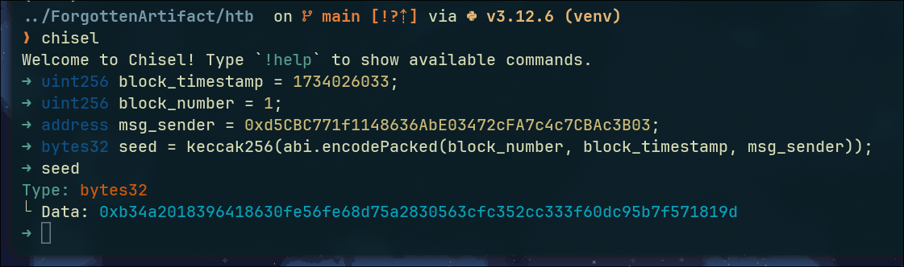

# ForgottenArtifact

5<sup>th</sup> Dec 2024 \
Prepared By: perrythepwner \
Challenge Author(s): **perrythepwner** \
Difficulty: <font color=green>Easy</font>

---

## TLDR
This challenge consists of calculating the storage pointer of a struct stored in a non-standard location in the contract memory to re-discover the "forgotten artifact" called "Starry Spurr".

## Description
> Deep within the uncharted territories of the Frontier Cluster lies a relic of immense power and mystery—the forgotten artifact known as "The Starry Spurr." Hidden away by the oppressive Frontier Board, its location has been lost to time. However, whispers persist that the artifact can only be recovered by those who understand the intricate mechanisms of the ledger technology. Your goal is to rediscover its location before the Frontier Board finds it and claim possession for the sake of power and wealth.

## Skills Required
- Basic understanding of Solidity and smart contracts
- Interaction with smart contracts
- Knowledge of Ethereum's storage layout and storage pointers

## Skills Learned
- Calculating and manipulating non-standard location of storage slots in Solidity

## Challenge Scenario
The Frontier Cluster, once a beacon of hope and prosperity, has been overshadowed by the ruthless Frontier Board. Among the many secrets they guard, "The Starry Spurr" remains the most coveted artifact, believed to possess unparalleled power. This artifact was hidden using sophisticated blockchain mechanisms to ensure its secrecy and protection.  
The players goal is to rediscover the forgotten artifact in the smart contract by reverse-engineering the original storing mechanism, before the Frontier Board finds it and claim possession for the sake of power and wealth.

## Analyzing the Source Code

### `Setup.sol`

```solidity
// SPDX-License-Identifier: MIT
pragma solidity ^0.8.18;

import { ForgottenArtifact } from "./ForgottenArtifact.sol";

contract Setup {
    uint256 public constant ARTIFACT_ORIGIN = 0xdead;
    ForgottenArtifact public immutable TARGET;
    
    event DeployedTarget(address at);

    constructor() payable {
        TARGET = new ForgottenArtifact(uint32(ARTIFACT_ORIGIN), address(0));
        emit DeployedTarget(address(TARGET));
    }

    function isSolved() public view returns (bool) {
        return TARGET.lastSighting() > ARTIFACT_ORIGIN;
    }
}
```

In order to satify the conditions to solve this challenge, the `lastSighting` storage variable of the target contract, should be set at a value higher that `ARTIFACT_ORIGIN`.

### `ForgottenArtifact.sol`
The `ForgottenArtifact` smart contract was used to hide the artifact in its storage memory, by crafting a pseudo-generated storage pointer and using low level assembly to move the struct pointer of the artifact to that newly generated location.

```solidity
// SPDX-License-Identifier: MIT
pragma solidity ^0.8.18;

contract ForgottenArtifact {
    uint256 public lastSighting;

    struct Artifact {
        uint32 origin;
        address discoverer;
    }

    constructor(uint32 _origin, address _discoverer) {
        Artifact storage starrySpurr;
        bytes32 seed = keccak256(abi.encodePacked(block.number, block.timestamp, msg.sender));
        assembly { starrySpurr.slot := seed }
        starrySpurr.origin = _origin;
        starrySpurr.discoverer = _discoverer;
        lastSighting = _origin;
    }

    function discover(bytes32 _artifactLocation) public {
        Artifact storage starrySpurr;
        assembly { starrySpurr.slot := _artifactLocation }
        require(starrySpurr.origin != 0, "ForgottenArtifact: unknown artifact location.");
        starrySpurr.discoverer = msg.sender;
        lastSighting = block.timestamp;
    }
}
```

In detail:
- **`lastSighting`**: Tracks the last time the artifact was sighted. This variable is written at the contract creation by the constructor. The only way to modify it is within the `discover` function. 
- **`Artifact` struct**: Define the structer of the Artifact. It contains the `origin` of the artifact (timestamp) and the `discoverer`'s address.
- **Constructor**:
  - Calculates a psuedo-random `seed`, which will be then used as storage pointer, using the current `block.number`, `block.timestamp`, and `msg.sender`, which can be easily re-calculated.
  - Uses assembly to assign the `seed` as the storage slot for `starrySpurr`.
  - Initializes the `Artifact` struct with the provided `_origin` and `_discoverer`.
  - Sets `lastSighting` to `_origin`.
- **`discover()` function**:
  - Accepts a `_artifactLocation` parameter, presumed to be the storage slot of the artifact.
  - Uses assembly to load the `Artifact` stored at `_artifactLocation` (if any).
  - Requires that the `origin` is not zero, ensuring the artifact location is valid.
  - Updates the `discoverer` to `msg.sender` and `lastSighting` to the current block timestamp.

As we understood, the artifact, which is in the form of a struct, is not stored to a conventional location in the contract's storage layout, and this time it cannot be simply retrieved by using `eth_getStorageAt` and passing slot `0` as an argument.  
Instead, using low level assembly, the contract sets its storage location using the `seed` variable:

```solidity
Artifact storage starrySpurr;
bytes32 seed = keccak256(abi.encodePacked(block.number, block.timestamp, msg.sender));
assembly { starrySpurr.slot := seed }
```  

The first line creates a new variable `starrySpurr` by specifying the location as storage, which means it references a specific location in the contract's persistent storage rather than being a memory or calldata variable. This allows direct interaction with the contract's storage, see more information in the documentation [here](https://docs.soliditylang.org/en/latest/internals/layout_in_storage.html).  
Then, `seed` is generated by hashing the combination of `block.number`, `block.timestamp`, and `msg.sender`. If these values can be predicted or known, the storage slot can be recalculated.  
Finally, low level assembly is used to assign the `seed` as the storage slot for `starrySpurr`, effectively pointing the Artifact struct to a specific storage location that can be targeted for exploitation.  
In other words, these lines serves as a way to store a storage variable in a non-conventional storage slot by generating runtime a storage pointer.  
The goal of the player at this point is just to reverse engineer the pointer generation logic.

Although the logic for this one is pretty simple, we can avoid falling for silly mistakes and use Solidity code to directly generate that. For example, We can use [chisel](https://book.getfoundry.sh/chisel/) tool from the Foundry collection to have a nice Solidity REPL in our terminal to do so.  

However, the generation of this hash depends on block-specific variables (`block.number`, `block.timestamp`), meaning that, in order to reconstruct the correct hash, we need to recover the values for this variables used at the time of the contract creation.  
In order to do so, we can use tools like [cast](https://book.getfoundry.sh/cast/), [web3py](https://web3py.readthedocs.io/en/stable/) to fetch past transactions details.

## Exploitation
To solve this challenge, we have to re-calculate the seed hash used as pointer to store the artifact, and pass is to the `discover()` function as argument in order to set `lastSighting` variable to a new block timestamp.

### Step 1: get current block information

```sh
➜ cast block --rpc-url $RPC
baseFeePerGas        0
difficulty           0
extraData            0x
gasLimit             30000000
gasUsed              293780
hash                 0xd3e04275d3d832f6cab1f986fcb3b2d6e5dce9cd3914f0d76098f57923785066
logsBloom            0x00000000000000000000000000000000000000000000000000000001000000000000000000000000000000000000000000000000000000000000000000000000000000000000000040000000000000000000000000000000000000000000000000000000000000000000000000100000000000000000000000000000000000000000000000000000000000000000000000000000000000000000000000000100000000000000000000000000000000000000000000000020000000000000000000000000000000000000000000000000000000000000000000000001000000000000000000000000000000000000000000000000000000000000000000000000
miner                0x0000000000000000000000000000000000000000
mixHash              0x0000000000000000000000000000000000000000000000000000000000000000
nonce                0x0000000000000000
number               1
parentHash           0xc344a56f72f4ae832f7ef060fe7acd0e367644d7aa3c364877e367086d09469d
transactionsRoot     0x127229900c01b9e389b79b9f51caeb7175b90f64591896aa6765381d2ff69c7a
receiptsRoot         0x8294aad7e40b8fa738672bd806843726d2e94498d87ebdf0b38c5e83464c02f8
sha3Uncles           0x1dcc4de8dec75d7aab85b567b6ccd41ad312451b948a7413f0a142fd40d49347
size                 1856
stateRoot            0xd2ad8861be652b2cff0e61187388187f690844e24fcbf4cf48d227ed56fab617
timestamp            1734026033 (Thu, 12 Dec 2024 17:53:53 +0000)
withdrawalsRoot      0x56e81f171bcc55a6ff8345e692c0f86e5b48e01b996cadc001622fb5e363b421
totalDifficulty      0
transactions:        [
        0xf35c20de71490188ba89db398afdf07a7b3853e150fe0807cc4f266f7b2c613f
]
```
We see that only 1 block is mined, and it's block number `1`, we needed that. The block contains only 1 transaction, possibly the contract creation. We can use `cast` again to fetch for detailed information using the provided transaction hash.  
Another important value we can notice, is the `timestamp` param, giving us the `block.timestamp` value we needed (`1734026033`). 

### Step 2: retrieve transaction details
```sh
➜ cast tx 0xf35c20de71490188ba89db398afdf07a7b3853e150fe0807cc4f266f7b2c613f --rpc-url $RPC
accessList           []
blockHash            0xd3e04275d3d832f6cab1f986fcb3b2d6e5dce9cd3914f0d76098f57923785066
blockNumber          1
chainId              31337
from                 0x5B288F7f432156D2653CC518859b6FD5F77a3123
gasLimit             293780
hash                 0xf35c20de71490188ba89db398afdf07a7b3853e150fe0807cc4f266f7b2c613f
input                0x60a060405261dead5f604051601290608b565b63ffffffff90921682526001600160a01b03166020820152604001604051809103905ff0801580156045573d5f5f3e3d5ffd5b506001600160a01b031660808190526040519081527fc26ec5464cc58ea5f3597f1daab5d82585655e1bfd634b0a94fdd5ab63740dbf9060200160405180910390a16098565b6102558061024283390190565b60805161018d6100b55f395f8181607c015260bc015261018d5ff3fe608060405234801561000f575f5ffd5b506004361061003f575f3560e01c8063468e2c681461004357806364d98f6e1461005f578063cc1f2afa14610077575b5f5ffd5b61004c61dead81565b6040519081526020015b60405180910390f35b6100676100b6565b6040519015158152602001610056565b61009e7f000000000000000000000000000000000000000000000000000000000000000081565b6040516001600160a01b039091168152602001610056565b5f61dead7f00000000000000000000000000000000000000000000000000000000000000006001600160a01b0316634e3d72b26040518163ffffffff1660e01b8152600401602060405180830381865afa158015610116573d5f5f3e3d5ffd5b505050506040513d601f19601f8201168201806040525081019061013a9190610140565b11905090565b5f60208284031215610150575f5ffd5b505191905056fea2646970667358221220a80d2b468a927403c0935c79d3bfca66e9ffe0eddd8714585fde84d6b8359b9264736f6c634300081c0033608060405234801561000f575f5ffd5b5060405161025538038061025583398101604081905261002e916100b6565b5f5f43423360405160200161006393929190928352602083019190915260601b6001600160601b031916604082015260540190565b60408051601f19818403018152919052805160209091012080546001600160a01b03909416640100000000026001600160c01b031990941663ffffffff9095169485179390931790925550505f55610101565b5f5f604083850312156100c7575f5ffd5b825163ffffffff811681146100da575f5ffd5b60208401519092506001600160a01b03811681146100f6575f5ffd5b809150509250929050565b6101478061010e5f395ff3fe608060405234801561000f575f5ffd5b5060043610610034575f3560e01c80630f9b5d1f146100385780634e3d72b21461004d575b5f5ffd5b61004b6100463660046100fa565b610067565b005b6100555f5481565b60405190815260200160405180910390f35b8054819063ffffffff165f036100d95760405162461bcd60e51b815260206004820152602d60248201527f466f72676f7474656e41727469666163743a20756e6b6e6f776e20617274696660448201526c30b1ba103637b1b0ba34b7b71760991b606482015260840160405180910390fd5b8054640100000000600160c01b031916336401000000000217905550425f55565b5f6020828403121561010a575f5ffd5b503591905056fea2646970667358221220c457a2f3cb835798de697f5a7f785f8f5835342365fe4032d2f55d95d8169efb64736f6c634300081c0033
maxFeePerGas         1000000000
maxPriorityFeePerGas 1000000000
nonce                0
r                    0x34b919a9b01d04a2b0b11191e3308adbaf13abc314bef31f1b0d952e75580969
s                    0x39bfd5b956a7c1c0301b02733fc773e6c6f7519088679cb0020f77eb375e297d
to
transactionIndex     0
type                 2
value                0
yParity              1
```
The transaction with long data, the `to` param pointing to address zero, and the first bytes of the data being `0x60a06040` (see why [here](https://ethereum.stackexchange.com/questions/129737/new-contract-deployment-pattern-0x60c06040)), confirms the transaction as the one that created the contract.  
Note that, the `from` parameter in this transaction, won't be the actual `msg.sender` used to calculate the hash in the `ForgottenArtifact` contract, because the `Setup` contracts is responsible to deploy the challenge contract and therefore the constructor will see the address of `Setup` as the actual `msg.sender`. The setup contract address can be easily retrieved using the TCP challenge handler:

```sh
➜ nc $IP $PORT
1 - Get connection informations
2 - Restart Instance
3 - Get flag
Select action (enter number): 1
[*] Found node running. Retrieving connection informations...

[...]
Setup contract     : 0xd5CBC771f1148636AbE03472cFA7c4c7CBAc3B03
[...]
```

### Step 3: reconstruct `seed` hash
As we have everything we need to reconstruct the storage pointer used, i.e. the artifact location, we can finally use `chisel` to easily calculate the hash.



### Step 4: call function `discover()` with the calculated hash
At this point, we just need to call the `discover` function with the correct hash, i.e. the artifact storage location pointer.

```sh
➜ cast send $TARGET "discover(bytes32)" 0xb34a2018396418630fe56fe68d75a2830563cfc352cc333f60dc95b7f571819d --rpc-url $RPC --private-key $PVK

blockHash               0x99f4e19feb3a73b69c00d3332d233a24042e49f821d99e0c7502ecda3b8051a6
blockNumber             5
contractAddress
cumulativeGasUsed       31953
effectiveGasPrice       1000000000
from                    0x3475E621b91f45b02Af368EcC147B0a90Acad4D5
gasUsed                 31953
logs                    []
logsBloom               0x00000000000000000000000000000000000000000000000000000000000000000000000000000000000000000000000000000000000000000000000000000000000000000000000000000000000000000000000000000000000000000000000000000000000000000000000000000000000000000000000000000000000000000000000000000000000000000000000000000000000000000000000000000000000000000000000000000000000000000000000000000000000000000000000000000000000000000000000000000000000000000000000000000000000000000000000000000000000000000000000000000000000000000000000000000000
root
status                  1 (success)
transactionHash         0x8ba39c9d1958c49f4160ae9e8a85826eed7a1b9577e0b55d7790f297179ded13
transactionIndex        0
type                    2
blobGasPrice            1
blobGasUsed
authorizationList
to                      0x8fBF2638fD86021c3Db33c70bE3d06B64C549dA7
```

Win!  
We can now connect back to the challenge handler, that will check conditions by calling the `isSolved()` function in the `Setup` contract, and print the flag.

```sh
➜ nc $IP $PORT
1 - Get connection informations
2 - Restart Instance
3 - Get flag
Select action (enter number): 3
HTB{y0u_c4n7_533_m3}
```

## Bonus
We could also have done that using `web3py`:
```py
[...]
    ForgottenArtifact = w3.eth.contract(address=target_addr, abi=target_abi)
    Setup = w3.eth.contract(address=setup_addr, abi=setup_abi)
    print(f"[*] Retrieving artifact origin transaction")
    logs = Setup.events.DeployedTarget.get_logs(from_block=0)
    deployed_log = logs[0]
    origin_tx = deployed_log["transactionHash"].hex()
    print(f"[*] Origin transaction: {origin_tx} @ block {deployed_log['blockNumber']}")
    print(f"[*] Retrieving block informations")
    origin_block = w3.eth.get_block(deployed_log["blockNumber"])
    print(f"[*] Block informations: {origin_block}")
    block_number = origin_block["number"]
    block_timestamp = origin_block["timestamp"]
    print(f"[*] Block number: {deployed_log['blockNumber']}, timestamp: {block_timestamp}, msg.sender: {setup_addr}")
    seed = w3.keccak(encode_packed(["uint", "uint", "address"], [deployed_log["blockNumber"], block_timestamp, setup_addr]))
    print(f"[*] Artifact storage pointer location: 0x{seed.hex()}")
    print(f"[*] Discovering artifact")
    ForgottenArtifact.functions.discover(seed).transact()
```

see the full exploitation script [here](./htb/solver.py).

---
> HTB{y0u_c4n7_533_m3}