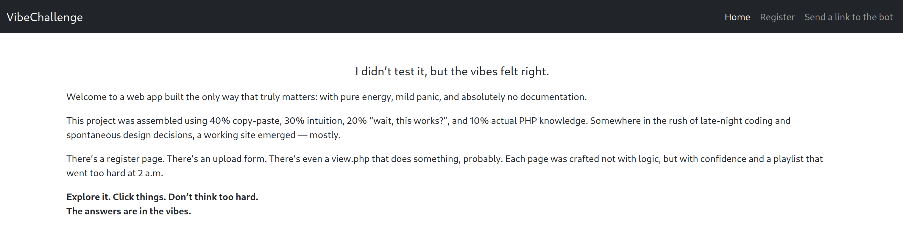
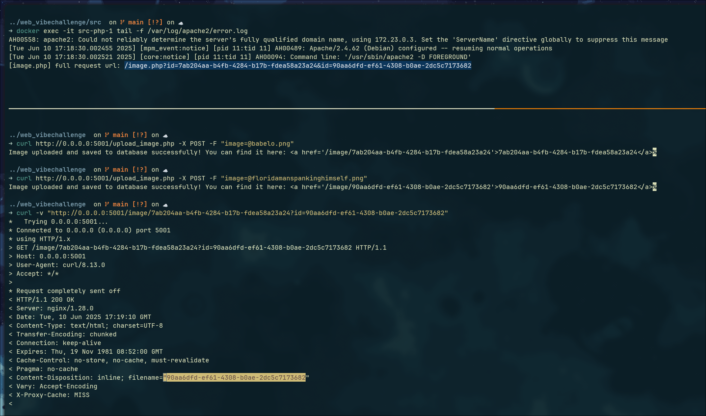
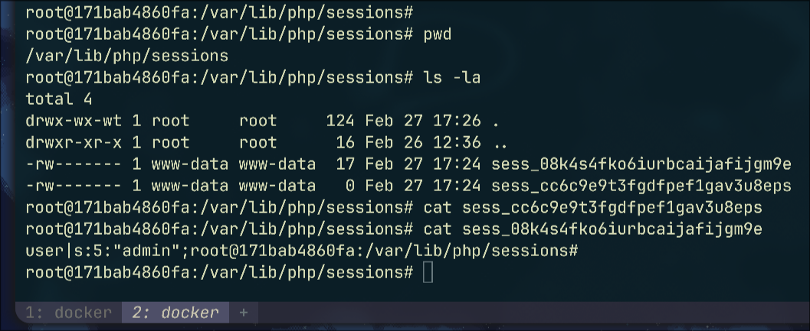
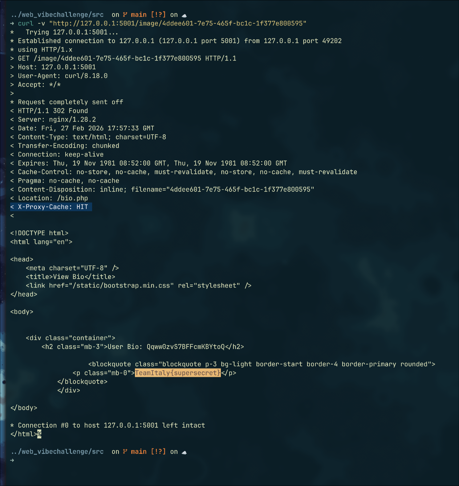

# TeamItaly 2025 Quals - VibeChallenge 


First blooding this challenge put me in first place for the web players selection for the official TeamItaly 2025 qualification event! :)


## Description
> A web challenge built on instinct, caffeine, and zero planning. Everything kind of works — and that’s good enough. Follow the vibes. Something might happen.

## Challenge scenario
The challenge is a php webapp on php-cgi served with Apache. The php service then sits behind an nginx reverse proxy, with the following configurations

**nginx.conf**
```nginx
user nginx;
worker_processes auto;

events {
    worker_connections 1024;
}

http {
    proxy_cache_path /var/cache/nginx levels=1:2 keys_zone=STATIC:100m inactive=60m use_temp_path=off;

    include /etc/nginx/mime.types;
    default_type application/octet-stream;

    sendfile on;
    keepalive_timeout 65;

    include /etc/nginx/conf.d/*.conf;
}
```

**default.conf**
```nginx
server {
    listen 80;

    add_header Content-Security-Policy "default-src 'self';" always;
    add_header X-Content-Type-Options nosniff always;

    location / {
        set $proxy_host ${BACKEND_HOST};
        proxy_pass http://$proxy_host:80;

        proxy_set_header Host $host;
        proxy_set_header X-Real-IP $remote_addr;
    }

    location /cgi-bin/ {
        deny all;
    }

    location ~ ^/image.php$ {
        deny all;
    }

    location /static/ {
        proxy_pass http://${BACKEND_HOST}:80;
        proxy_cache STATIC;
        proxy_cache_valid 200 302 10m;
        proxy_cache_valid 404      1m;
        proxy_cache_key "$scheme$proxy_host$request_uri";
        add_header X-Proxy-Cache $upstream_cache_status; 
        proxy_ignore_headers Set-Cookie Cache-Control Expires;
    }

    location ~ "^\/image\/([a-fA-F0-9]{8}-[a-fA-F0-9]{4}-[a-fA-F0-9]{4}-[a-fA-F0-9]{4}-[a-fA-F0-9]{12})" {
        rewrite "^\/image\/(?<uuid>[a-f0-9]{8}-[a-f0-9]{4}-4[a-f0-9]{3}-[89ab][a-f0-9]{3}-[a-f0-9]{12})$" /image.php?id=$uuid break;
        proxy_pass http://${BACKEND_HOST}:80;
        proxy_cache STATIC;
        proxy_cache_valid 200 302 5m;
        proxy_cache_valid 404      1m;
        proxy_cache_key "$scheme$proxy_host$request_uri";
        add_header X-Proxy-Cache $upstream_cache_status; 
        proxy_hide_header Set-Cookie;
        proxy_ignore_headers Set-Cookie Cache-Control Expires;
    }
}
```

The nginx configuration has a cache zone setup for `/static/` and `/image/` paths under `/var/cache/nginx` with no per-user distinction because of the cache key being constructed only with `$scheme`, `$proxy_host` and `$request_uri` variables.

Regarding the php webapp, we can register as a user, update our bio, upload images and report an url to the bot.



The code responsible for the `/register.php` endpoint is the following:

**register.php**
```php
include 'utils.php';

if ($_SERVER["REQUEST_METHOD"] === "POST") {
    $username = trim($_POST["username"]);
    if ($username) {
        start_session();
        $_SESSION['user'] = $username;
        if ($_COOKIE['next']) {
            redirect($_COOKIE['next']);
            setcookie('next', '', -1, '/');
        } else {
            redirect('/');
        }
    }
}
```

Upon providing a username with a POST request, a session is created with the `start_session()` utility function:

**utils.php**
```php
function start_session(){
    $hardening_options = [
        'lifetime' => 6000,
        'path' => dirname($_SERVER['ORIG_PATH_INFO']),
        'domain' => $_SERVER['HTTP_HOST'],
        'httponly' => true,  
    ];
    session_set_cookie_params($hardening_options);
    session_start();
}
```

Interestingly, if the `next` cookie is present at the time of registration, its value will be used as redirect path target, otherwise the user will simply be redirected to the homepage.

The bio functionality is just:

**update_bio.php**
```php
include 'utils.php';
include 'is_logged.php';

$user = $_SESSION['user'];

if (isset($_POST['bio'])) {
    $bio = htmlspecialchars($_POST['bio']);
    $_SESSION['bio'] = $bio;
    redirect('/bio.php');
}
```

Since the bio content is sanitized with `htmlspecialchars` there's no free XSS for us :(

The image upload functionality is pretty much just boilerplate, so I'll skip it. Just something to know is that the `/upload_image.php` will handle the form submission and save the image in the db with an UUID filename (so no html injection or header injection within the filename). Then the same image can be viewed via the `/image/<uuid>` endpoint, where nginx will take the UUID from the path and rewrite it to `/image.php?id=<uuid>`. 


The UUID parameter passed in `/image` is validated by nginx with the provided regex, moreover direct access to `/image.php` is denied by nginx, but if that would have been of our interest we could have kinda bypassed it by clobbering the `?id` parameter in the nginx rewrite. In the screenshot below I upload the `babelo.png` image that gives me the `7ab2...` uuid, and the `floridamanspankinghimself.png` image that gives me the `90aa...` uuid, then I access the `/image/7ab2...?id=90aa...` endpoint and the second image is served instead of the first one. In the apache logs i logged the full request URI in `image.php` and it shows the clobbering. I could've also used whatever value as the `id` parameter because the validation happens only on the nginx side.


 

But anyway that's just useless in this challenge scenario.

Note that what all these endpoints (`upload_image.php`, `image.php`, `update_bio.php`, `bio.php`) have in common is the `include 'is_logged.php'` at top of the script, so it's definitely worth taking a look:

**is_logged.php**
```php
start_session();

/* Check if the user is logged. If not redirect to the registration page.*/
if (!isset($_SESSION['user'])) {
    setcookie('next',  $_SERVER['ORIG_PATH_INFO'], path: "/");
    redirect('/register.php');
}
/* if newly logged redirect to next url */ else if (isset($_COOKIE['next'])) {
    redirect($_COOKIE['next']);
    setcookie('next', '', -1, '/');
}
```

This snippet firstly starts a new session or resumes the current one by checking the given (if any) `PHPSESSID` cookie, checks if the user have an active session, if not it sets the `next` cookie with the current path and redirects to `/register.php`. If the user is logged in instead, and the `next` cookie is present, it redirects to that path.  
It sounds like a promising client side gadget, but that's just not enough to solve the challenge.  
As common for client side challenges, the actions the bot does, is a crucial part of the challenge, so let's shift the focus to it.

**bot.php**
```php
    [...]
    if (isset($_POST['url'])) {
        $url = $_POST['url'];
        if (!str_starts_with($url, "http://") && !str_starts_with($url, "https://")) {
            die("Url is not valid");
        }
    }

    $actions = [
        'browser' => 'chrome',
        'timeout' => 120,
        'actions' => [
            [
                'type' => 'request',
                'url' => $_POST['url'],
                'timeout' => 10
            ],
            [
                'type' => 'sleep',
                'time' => 10
            ],

            // Register the account
            [
                'type' => 'request',
                'url' => $CHALLENGE_URL . '/register.php',
                'timeout' => 20
            ],
            [
                'type' => 'type',
                'element' => 'input#username',
                'value' => $username
            ],
            [
                'type' => 'click',
                'element' => 'button#submit',
            ],
            [
                'type' => 'sleep',
                'time' => 5
            ],

            // Insert the flag
            [
                'type' => 'request',
                'url' => $CHALLENGE_URL . '/update_bio.php',
                'timeout' => 20
            ],
            [
                'type' => 'type',
                'element' => 'textarea#bio',
                'value' => $FLAG
            ],
            [
                'type' => 'click',
                'element' => 'button#submit',
            ],
            [
                'type' => 'sleep',
                'time' => 10
            ]
        ]
    ];
```

We can only report HTTP(s) urls, but no origin check is made, meaning we can make the bot visit a controlled page.  
Then, the bot will do the following:
1) Visit the provided URL
2) sleep 10s
3) Register a new user with a random username
4) sleep 5s
5) Update the user bio with the flag
6) sleep 10s

For anyone with a bit of client side challenge experience knows that it's not too common to have the bot visit our controlled page before putting flag or any actions in general, therefore it can be an hint of what to search for.  


A first idea was some sort of [session fixation](https://owasp.org/www-community/attacks/Session_fixation#:~:text=The%20attack%20consists%20of%20obtaining%20a%20valid%20session%20ID%20%28e.g.%20by%20connecting%20to%20the%20application%29%2C%20inducing%20a%20user%20to%20authenticate%20himself%20with%20that%20session%20ID%2C%20and%20then%20hijacking%20the%20user-validated%20session%20by%20the%20knowledge%20of%20the%20used%20session%20ID.), by forcing the bot to login with a user we know, and write the flag to the bio of that user, and finally retrieving it later. Clearly, such attack is not trivially possible on modern browsers, but some CSRF-vulnerable applications could allow it.
While looking for such possibility in PHP I found the [`session.use_trans_sid`](https://www.php.net/manual/en/session.configuration.php#ini.session.use-trans-sid) option, which [allows to pass the PHPSESSID via as URL param](https://www.php.net/manual/en/session.idpassing.php#:~:text=PHP%20is%20capable%20of%20transforming%20links%20transparently.%20If%20the%20run-time%20option%20session.use_trans_sid%20is%20enabled%2C%20relative%20URIs%20will%20be%20changed%20to%20contain%20the%20session%20id%20automatically.%20). However, this option is disabled by default and indeed the PHP documentation also states the security risks around it.


Apart from that, no particular user interaction is made, so we have to invent something with what we have.

## Solution
Since we can send the bot to an arbitrary HTTP(S) url, we can take advantage of the `next` cookie behaviour to possibily redirect the bot to any endpoint, we also know that some caching is being used for the `/image/` where we can also upload an image, and that the bot will visit our controlled page before writing the flag to the bio.  
Given that the `/image/<uuid>` route is rewritten to `/image.php?id=<uuid>` and that in `image.php` the `is_logged.php` is included, we can maybe leverage the `next` cookie to force a redirect in `image.php` to the `/bio.php` page and therefore cache the response (including the flag) under a `/image/<uuid>` path?

### RFC 3875 and Local Redirects
"*But won't nginx just cache the 302 redirect and let that redirect happen on the client side?*"  
It makes sense, but that's not the case in Apache for CGI scripts, that is correctly following **RFC 3875**. Taken from [Orange Tsai "Confusion Attacks: Exploiting Hidden Semantic Ambiguity in Apache HTTP Server!" research](https://blog.orange.tw/posts/2024-08-confusion-attacks-en/): RFC 3875 is a specification about CGI, and Section 6.2.2 defines a "Local Redirect Response" behavior:

> [...] The CGI script can return a URI path and query-string (‘local-pathquery’) for a local resource in a Location header field. This indicates to the server that it should reprocess the request using the path specified.

**The specification mandates that under certain conditions, CGI must use Server-Side resources to handle redirects**. In other words, Apache internally follows 302 redirects on CGI scripts responses when the `Location` header is present with a path that begins with `/`, and therefore nginx will see the final response from Apache, which is the `/bio.php` page and cache it under the `/image/<uuid>` path.

Nice, sounds good. Where do we start then?  
First of all, our goal is to have the bot visit the `/image/<uuid>` endpoint with a `next` cookie set to `/bio.php`, and in order to make it have effect, we want to hit the else branch of the `is_logged.php` snippet, with a valid session, and make the bot redirect.

```php
/* Check if the user is logged. If not redirect to the registration page.*/
if (!isset($_SESSION['user'])) {
    setcookie('next',  $_SERVER['ORIG_PATH_INFO'], path: "/");
    redirect('/register.php');
}
/* if newly logged redirect to next url */ else if (isset($_COOKIE['next'])) {
    redirect($_COOKIE['next']);
    setcookie('next', '', -1, '/');
}
```

We know that Apache will follow that local redirect and so the final cached page by nginx will be the `/bio.php` page with the flag it just put. 

### "Schrödinger cookies"
But, how can we have an active session to reach the cachable page via redirect, but at the same time don't have an active session to set the `next` cookie? If we look into the `start_session()` function again, we note one fundamental detail:

```php
function start_session(){
    $hardening_options = [
        'lifetime' => 6000,
        'path' => dirname($_SERVER['ORIG_PATH_INFO']),
        'domain' => $_SERVER['HTTP_HOST'],
        'httponly' => true,  
    ];
    session_set_cookie_params($hardening_options);
    session_start();
}
```

The session cookie is set with the `path` option to `dirname(ORIG_PATH_INFO)` which is basically just the cgi script name we're hitting. E.g. if we request the `/bio.php/whatever` resource, `ORIG_PATH_INFO` will be set to `/bio.php/whatever`, and `dirname("/bio.php/whatever")` will be `/bio.php`, meaning that the session cookie will be scoped to the `/bio.php` path.

Ok, so we just make the unauthenticated bot visit the `/bio.php` endpoint so that the `next` cookie will be set to `/bio.php`, and then make the bot visit `/image/<uuid>` after login to cache the flag with the redirection?

Yes, but we have a few issues with that: 
1) if we set `next=/bio.php` before the bot registers, the `next` cookie will be immediately consumed just after the register form submission because of the else branch in `is_logged.php`.
2) we can't set `next=/bio.php` after the bot registered and put the flag in the bio, because at that point a session will be already active and no `next` cookie will be created. Also, the flag is stored inside the session, so we can't just somehow make the session die and then cache the flag.

At this point, we come to the conclusion that we need a sort of **"Schrödinger cookie" state**: keep the bot logged in enough to write the flag, but preserve a `next` value that will later force `/image/<uuid>` to answer with a redirect to `/bio.php`.

<center>

</center>

This was kinda confusing to me in the first place, and honestly I didn't understood everything that was going on at the time of solving this challenge. A lot of assumptions were made based on experience and trial & error. There was not much room for overthinking.  
In fact, by playing a bit with some edge case scenarios I found that creating two sessions (`path=/` and `path=/bio.php`), caused some confusion and somehow I was able to pass on the `/image/<uuid>` unauthenticated and getting the 302 redirect with the flag in the cache of my uploaded image path, but I didn't really fully understood how that happened in that moment.

### RFC 6265 and cookie sorting to shadow bot session
So, how was that possible? At CTF ended I looked into it and found plausible explanations:  
- Both `PHPSESSID` cookies are stored by Chrome.
- In accordance to [RFC 6265 §5.4(2)](https://datatracker.ietf.org/doc/html/rfc6265#section-5.4), User Agents should sort cookies if multiple are present in the `Cookie` header. That **sorting is firstly prioritizing `path` length**. Yes, the value length, not "the most nested path" nor "the stricter scope" or any other semantic measure.
> [...]
>  2. The user agent SHOULD sort the cookie-list in the following order:
>   *  Cookies with longer paths are listed before cookies with shorter paths.

So, given two `PHPSESSID` cookies with `path=/aaa.php` and `path=/bbbb.php`, the second one will be prioritized in the sorting. Same goes for `path=/a/a.php` vs `path=/bbbb.php`. And, obviously, in our case `path=/bio.php` will be prioritized over `path=/`.  
Moreover:
- Multiple cookies being sorted in the `Cookie` header by Chrome doesn't necessarly means that the first one will be prioritized when processed by the HTTP server. However, that is the case for PHP, as **it does take the first occurrence in the header**.
- Being the cookie with scope `path=/bio.php` the selected one for the session, PHP will consider it not valid for any navigation outside `/bio.php` and therefore the `/image/<uuid>` request with the two cookies will effectively being considered as an unauthenticated request on that route. No, PHP does not fallback on the second cookie because the `$_COOKIE` superglobal exposes only one entry per name. The `path=/` cookie is effectively useless because it'll always being ignored while the `path=/bio.php` cookie exists in the browser.

This is useful for us, because it allows us to have a session state in the browser that is effectively "authenticated" only for the `/bio.php` path, exactly the "Schrödinger cookie" we needed.  
At this point, we only need to make the bot reach the `/image/<uuid>` endpoint with the `next=/bio.php` cookie set, so that a 302 redirect (that, again, is internally followed by Apache) to the authenticated view of `/bio.php` is cached by nginx under the `/image/<uuid>` path. **This is Cache Deception and allows us to retrieve the flag later on from the cache**.

However, we can't just set and forget the `next=/bio.php` cookie, because of the first issue we mentioned: if we set it before registration, it'll be consumed immediately after the form submission and the bot will never be able to write and submit the flag in the `update_bio.php` form.  
So, how the hell can we have the `next=/bio.php` cookie set, but not consumed at registration time?

### Forcing cookie deletion with CRLF injection
I found a pretty neat trick by **injecting CRLF in the `next` cookie value**: If we set `next` to something like `/bio.php/%0d%0aXXX`, then when PHP later executes `header('Location: ' . $_COOKIE['next'])`, it detects the newline and refuses that `Location` header with a `Warning: Header may not contain more than a single header, new line detected in /var/www/html/utils.php on line 10` warning. See [PHP source code](https://github.com/php/php-src/blob/master/main/SAPI.c#L757-L767).  
This allows us to both probe the `/bio.php` path to create the `path=/bio.php` session cookie before registration, let the bot register and so it creates the `path=/` session cookie too, AND don't have an annoying `next` cookie so that the bot can later write the flag in the bio:


When the bot sets the flag from the `/update_bio.php` page later on, the `next` cookie will not be present, so the form will successfully redirect to `/bio.php`, and since the `path=/bio.php` session cookie is valid for that path, the flag will be correctly stored in the session and shown in the bio page.  
BUT, at this point, the `bio.php` page will also redirect to `register.php` (`update_bio.php (302) -> bio.php (302) -> register.php`)! WHY !?

Well, we talked about the two active session cookies as "authenticated" for their respective paths, but actually the `path=/bio.php` session cookie is not really "authenticated", because the registration form submission saved user information only inside the `path=/` scoped session!  
Let's have a look at the session of the previous image inside the container at `/var/lib/php/sessions/`:  



As we can see, the `path=/bio.php` scoped session cookie (`sess_cc6c9e9t3fgdfpef1gav3u8epsh7`) **is effectively empty**. When the bot visits `/bio.php` with that cookie, the `is_logged.php` snippet will check for the presence of `$_SESSION['user']`, but since that session is empty, it will consider the bot as unauthenticated and therefore redirect to `register.php`, AND also set the `next=/bio.php` cookie!

That's actually perfect for us, because it allows to have the following final exploitable cookie state:
- `PHPSESSID=cc6c9e9t3fgdfpef1gav3u8eps path=/bio.php` session cookie **without** user information, but containing the session-stored bio, i.e. the flag. 
- `PHPSESSID=08k4s4fko6iurbcaijafijgm9e path=/` session cookie with authenticated user information, will be ignored in favour of the other one.
- `next=/bio.php` cookie set after the bio update form submission.

Given this, just making the bot visit the `/image/<uuid>` endpoint will cause:
1) only the `path=/bio.php` session cookie to be considered, which does not contain `$_SESSION['user']`, so the else branch of `is_logged.php` is executed, and the bot is redirected
2) the bot is redirected to `/bio.php` because of the `next` cookie
3) on the `/bio.php` page, the `path=/bio.php` session cookie is valid, so the flag is shown in the bio and not redirected again.
4) nginx caches this redirection flow under the `/image/<uuid>` path.

**All that, caused by just making the bot visit a `/bio.php/%0d%0aX` endpoint before registration!**

"*Umhhh, but if it will redirect to this path won't the server just give 404 and not match the `/bio.php` cgi script?*"    
Not with default apache settings for CGI scripts ([taken from apache documentation](https://httpd.apache.org/docs/2.4/mod/core.html)):
> The [`AcceptPathInfo`](https://httpd.apache.org/docs/2.4/mod/core.html#AcceptPathInfo) directive *controls whether requests that contain trailing pathname information that follows an actual filename (or non-existent file in an existing directory) will be accepted or rejected.*, and ... *Handlers that serve scripts, such as cgi-script and isapi-handler, generally accept PATH_INFO by default*.  

In other words, the `/bio.php/whatever` request is handled by `bio.php` and gives us the path-scoped session behavior we need.

## Exploitation
Fantastic, we have everything in place. Putting everything together:  
1) We upload an image with the `/upload_image.php` endpoint, which will give us a `/image/<uuid>` endpoint to access the image. We DO NOT visit that endpoint yet to not infer the nginx cache.
2) We can send the bot to `/bio.php/%0d%0aX`, an empty session cookie scoped to `/bio.php` will be created, and also a `next=/bio.php/%0d%0aX` cookie.
3) We let the bot register. This action will create a new session cookie with user information + `path=/`, destroy the `next=/bio.php/%0d%0aX` too and return the warning.
4) We let the bot put the flag in his bio.
5) The update bio form submission will redirect to `/bio.php`, save the flag on the empty session, and then redirect to `register.php`. Will also set the `next=/bio.php` cookie. 
6) Then we send the bot to `/image/<uuid>` from step 1). `is_logged.php` emits `Location: /bio.php`, Apache follows that internally, and nginx caches that response (status 302, body contains the flag page).
7) We access the same `/image/<uuid>` from our side and read the cached flag.

The solve script is therefore as simple as:
```html
<html>
<body>
  <script>
    const indicator = new URLSearchParams(window.location.search).get('i');
    const sleep = (ms) => new Promise((resolve) => setTimeout(resolve, ms));

    if (indicator == "setup") {
      window.open("/?i=exploit")
    }
    else if (indicator == "exploit") {
      (async () => {
        window.open("http://nginx/bio.php/%0d%0aX"); // do our lil trick before registration
        fetch("/step1");
        await sleep(42_000); // give time to the bot to register and update the bio with the flag
        window.open("http://nginx/image/4ddee601-7e75-465f-bc1c-1f377e800595"); // force the bot to cache the flag page on this endpoint
        fetch("/step2");
      })();
    }
  </script>
</body>
</html>
```

We then submit the `http://xxxxx.requestrepo.com/?i=setup` url to the bot, and after the report we retrieve the flag at `/image/4ddee601-7e75-465f-bc1c-1f377e800595`:



> `TeamItaly{ch47gp7_54id_17_w45_f1n3_50_175_f1n3_cc4150dd0957c18f}`
